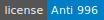
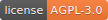

# TinaX
“开箱即用”的Unity独立游戏开发工具 | Unity-based Game Client Framework

?> 为美好的游戏献上Framework!

TinaX Framework 是基于Unity引擎的简单、完整的、开箱即用的开发框架。TinaX的目标是制作一个可以让一个团队、公司“从小用到大”的框架。

## 运行环境

**Unity**
- 当前TinaX开发版本：`Unity 2019.3.7f1`
- 推荐用于生产环境的版本：`Unity 2019.4.x LTS`
- 理论最低兼容版本：`Unity 2019.3.x`

**C# 版本**
- Unity Api Compatibility Level: `.NET 4.X`/`.NET Standard 2.0` 
- C# `7.2`

## 功能概述

**包**

TinaX Framework使用包（Packages）的形式来组织和管理各个功能的模块。为了方便使用UPM等工具直接安装，不同的包分别存放在各自独立的repo中。详见如下：

**服务**

TinaX 中分布在各个包中、功能单一的模块称为服务（`Service`）.

### TinaX.Core

`TinaX.Core`是TinaX Framework的基础包，它负责启动、管理所有的Service，提供通用的基础功能，提供事件系统、依赖注入等。

- 仓库地址：[https://github.com/yomunsam/TinaX.Core](https://github.com/yomunsam/TinaX.Core)
- 大陆镜像仓库: [https://gitee.com/nekonyas/TinaX.Core](https://gitee.com/nekonyas/TinaX.Core)
- 包名: `io.nekonya.tinax.core`

### TinaX.VFS

虚拟文件系统（VFS）是TinaX的资源管理服务，它在运行时中模拟了Unity工程中"Assets/xxx"的目录结构，实现了资源的加载、依赖管理、版本管理与更新、内存gc等。

- 仓库地址：[https://github.com/yomunsam/TinaX.VFS](https://github.com/yomunsam/TinaX.VFS)
- 大陆镜像仓库: [https://gitee.com/nekonyas/TinaX.VFS](https://gitee.com/nekonyas/TinaX.VFS)
- 包名：`io.nekonya.tinax.vfs`

### TinaX.UIKit

UIKit为TinaX提供了基于UGUI的UI管理服务，如打开、关闭、隐藏UI、全屏UI互相避让、UI启动参数等。同时提供对组件的扩展、可扩展的UI动画等相关内容。

- 仓库地址: [https://github.com/yomunsam/TinaX.UIKit](https://github.com/yomunsam/TinaX.UIKit)
- 大陆镜像地址：[https://gitee.com/nekonyas/TinaX.UIKit](https://gitee.com/nekonyas/TinaX.UIKit)
- 包名：`io.nekonya.tinax.uikit`

### TinaX.I18N

基于`key/value`形式的国际化支持服务，让你的应用对全世界不同语言和地区的用户更加友好。

- 仓库地址: [https://github.com/yomunsam/TinaX.I18N](https://github.com/yomunsam/TinaX.I18N)
- 大陆镜像地址：[https://gitee.com/nekonyas/TinaX.I18N](https://gitee.com/nekonyas/TinaX.I18N)
- 包名：`io.nekonya.tinax.i18n`

### TinaX.Lua

为TinaX提供Lua语言的开发运行环境。该服务基于`Tencent/xLua`开发。

- 仓库地址: [https://github.com/yomunsam/TinaX.Lua](https://github.com/yomunsam/TinaX.Lua)
- 大陆镜像地址：[https://gitee.com/nekonyas/TinaX.Lua](https://gitee.com/nekonyas/TinaX.Lua)
- 该部分内容需直接导入到工程`Assets`目录中，不以包形式提供