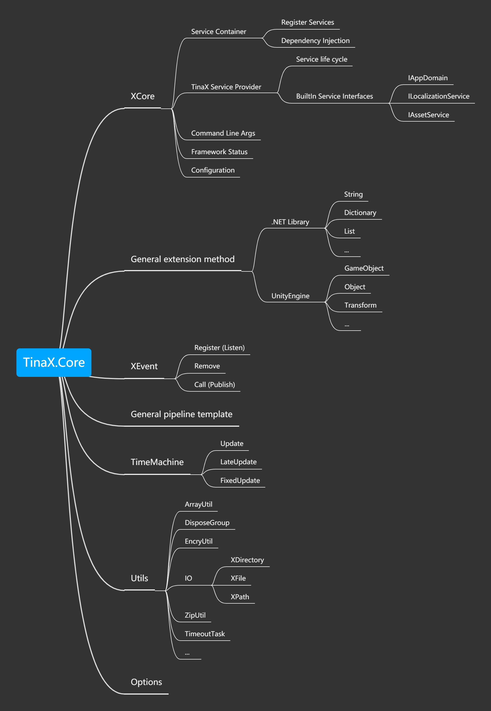

# TinaX.Core

`TinaX.Core`是TinaX Framework的核心库

package name: `io.nekonya.tinax.core`

## 使用

`TinaX.Core`使用包形式提供.

### OpenUPM

OpenUPM是目前推荐的使用Unity包的方式，您可在项目根目录中打开命令行操作如下：

``` bash
# Install openupm-cli if not installed.
npm install -g openupm-cli
# OR yarn global add openupm-cli

# run install in your project root folder
openupm add io.nekonya.tinax.core

# 大陆地区用户可使用openupm-cli大陆镜像
openupm-cn add io.nekonya.tinax.core
```
### Git Url

您也可使用git地址在Unity Package Manager直接安装：

```
git://github.com/yomunsam/TinaX.Core.git
```

或使用[其他方式](/cmn-hans/install.md)安装本包。

### 依赖

`TinaX.Core`依赖如下包，如使用Git等方式安装Package,请在安装本包前确保以下包已被安装（其他方式无需手动管理依赖）：

- [com.neuecc.unirx](https://github.com/neuecc/UniRx#upm-package) :`https://github.com/neuecc/UniRx.git?path=Assets/Plugins/UniRx/Scripts`
- [com.cysharp.unitask](https://github.com/yomunsam/UniTask.UPM#install-via-git-url) :`https://github.com/Cysharp/UniTask.git?path=src/UniTask/Assets/Plugins/UniTask`

## 功能

### 总览



### XCore

XCore类似于`.NET`中的`通用主机`概念。

通常，整个游戏/应用 从[XCore](/cmn-hans/core/manual/XCore.md)开始启动，并由XCore驱动整个应用的生命周期。

XCore内部提供了服务容器以实施依赖注入设计模式，而几乎所有`TinaX`第一方和第三方的服务模块，均以依赖注入方式向开发者提供服务功能。一些框架相关的信息，也可以从XCore中获得。

您可以查看它的[说明](/cmn-hans/core/manual/XCore.md)了解如何启动框架，或查看它的详细[API文档](/cmn-hans/core/api/IXCore.md).

<br>

除此之外，TinaX.Core包中提供了一些基础系统，如[事件广播系统](/cmn-hans/core/manual/event.md)、通用配置、时间驱动、等.