# TinaX 国际化与本地化

TinaX I18N 基于key/value的形式提供国际化文本功能。接下来，我们将实现一个简单的i18n实例：

## 创建I18N字典

首先，我们需要创建key/value的文本字典。在中小型规模的项目中，我们可以直接使用Unity Asset形式来创建字典。

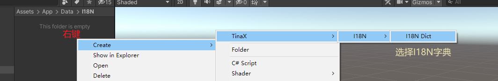

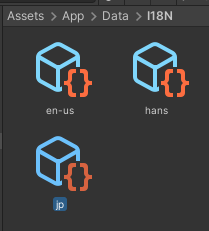

然后，我们在Unity`Inspector`界面中各设置一个key/value记录:

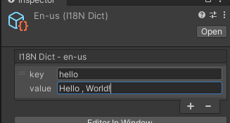

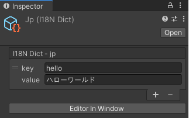

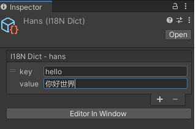

<br>

## 设置地区

打开项目`Project Settings`中的`X I18N`项，我们可以设置地区：

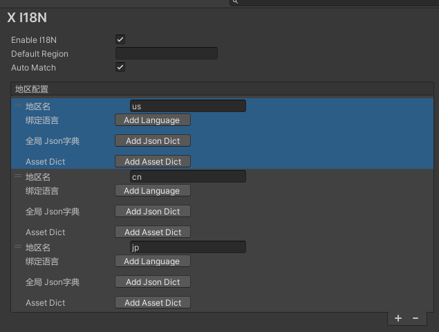

### 在地区中设置I18N字典

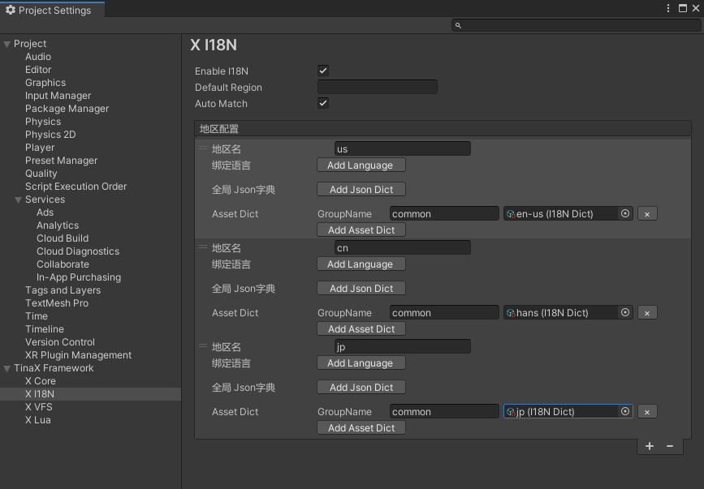

### 默认地区

在TinaX I18N中，有一个默认地区的概念。

首先我们可以在`Project Settings`中设置一个默认地区字段，该值即为“地区配置”列表中的“地区名”项。这样一来，在游戏/应用启动时，I18N框架将默认以该地区提供国际化文本查询。

同时，I18N框架也提供了自动匹配（Auto Match）功能，当启用该功能后，在游戏/应用启动时，I18N框架将读取当前系统语言，并在地区配置列表中找到第一个绑定了对应系统语言的地区，以此作为I18N框架的默认地区。

<br>

## 地区和语言

其实我们发现，在不少其他的I18N框架中，会直接以语言作为划分国际化的标识，其实这是不准确的。比如仅以我们当前所阅读的简体中文来讲，就有“中国”、“新加坡”、“马来西亚”三个国家或地区使用。

而同样是中文，可能同一个事物在不同的地区说法是不同的，例如：“智能手机/智慧手机”、“程序/程式”。

而更甚者，同样都叫“繁体汉字（正体汉字）”，不同地区的写法可能也不一样（图源自知乎）：


不仅仅是中文如此，其他语言也都有类似的问题，甚至问题更严重。

所以严谨来看，TinaX I18N框架使用地区概念来进行国际化处理，而非直接使用语言。

> 在TinaX I18N中，未避免不必要的无趣争议，仅有“地区”概念，没有“国家”概念。

<br>

## 创建UI

接下来，我们创建一个UGUI的UI页面，以便进行接下来的步骤。

?> 由于TinaX I18N 需要在TinaX框架启动完成之后才可正常运行，所以我们应该在框架启动之后再打开UI. <br> 借助`TinaX.UIKit`工具，我们可以很容易地做到。

我们创建一个空的UI页面，并在其中放置一个Text组件：

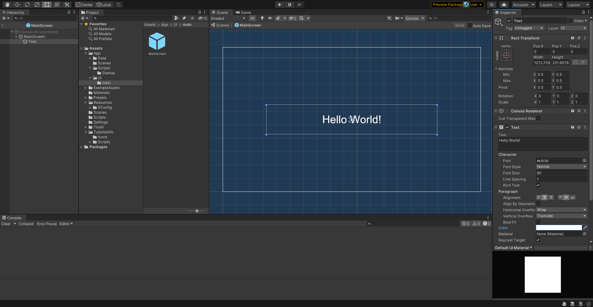

<br>

## 在UGUI中使用I18N

我们选中Text组件的GameObject，点击“Add Component”，添加`Text Localized` （`TinaX->I18N->Text Localized`）组件。

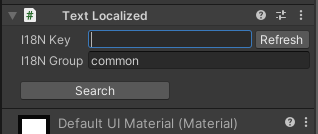

填写"I18N Key"字段为我们之前设置在字典里的`hello`


### 编辑器下实时预览

我们发现，在安装了TinaX I18N包之后，在编辑器顶部的右上角，多了一个图标：

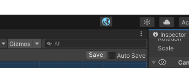

点击图标，在弹出的菜单中选择“Refresh Data”，之后图标右侧会多出一个下拉菜单：

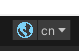

其中的cn表示“当前编辑器下采用的地区为cn”。

这时候，我们在刚才UI的Text Localized组件上点击"Refresh"按钮，观察到Text的值已被改变：

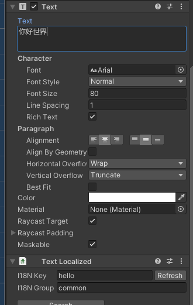


<br>

## 编辑器运行时切换语言

通过编辑器右上角的按钮，即可在编辑器运行时实时切换语言：


<br>

<br>

## 使用代码获取国际化文本

在上述的操作中，我们使用组件实现了UI的多语言切换，但是这在实际开发中远远不够，我们还需要通过代码来获取国际化文本。

实际上很简单，通过依赖注入或者其他方式得到TinaX I18N的服务接口`II18N`，使用如下方法：

``` csharp
using TinaX;
using TinaX.I18N;

[Inject] public II18N _I18N { get; set; } //在可被依赖注入的类中获取II18N接口

var _I18N = XCore.MainInstance.Services.Get<II18N>(); //手动从服务容器中获取II18N接口

var text = _I18N.GetText("i18n key"); //获取国际化文本
```

GetText的方法原型如下：
``` csharp
string GetText(string key, string groupName = "commond", string defaultText = null);
```

<br>

## 在代码中切换地区

在编辑器中，我们可以通过编辑器右上角的按钮切换地区。那么如果我们要把切换地区的功能做进游戏/应用里要怎么做呢，同样在`II18N`接口中：

``` csharp
Task UseRegionAsync(string regionName);
```

由于在中大型项目的推荐最佳实践中，我们会采用json文件来定义i18n字典，所以切换区域的过程中伴随着资产加载的过程。因此切换区域的方法是异步的，同样我们也提供了回调（callback）形式的异步方法：

``` csharp
void UseRegionAsync(string regionName, Action<XException> callback);
```

<br>

## 使用Json作为I18N字典

在中大型项目的最佳实践中，我们推荐采用json文件来定义i18n字典，原因如下：

1. 使用Unity `.asset`文件作为字典时，无法热更新，且会在项目启动后加载所有字典文件到内存中。
2. 在一定规模的团队中，分工明确，通常不会在Unity中编辑文案，而是在Excel、内部文案系统等软件中专门专人编写，并通过工具导出到客户端/服务端，使用Json文件更符合专业团队的工作流程。

接下来，我们试试把一开始创建的`.asset`形式的字典替换成Json字典，TinaX I18N框架中读取的Json文件格式如下：

``` json
{
    "data":[
        //key value ...
        {"k":"hello" , "v": "hello world"}
    ]
}
```

全部替换之后如下：

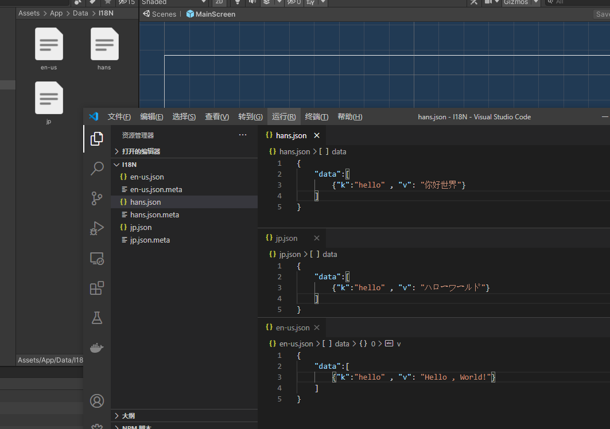


换成Json之后，I18N框架会在某个区域被使用时才加载某个区域的字典文件。

I18N框架使用`TinaX 内置服务接口`中的[资源接口](/cmn-hans/core/manual/IAssetService) 来加载这些Json文件，这也就意味着，我们的框架中需要有一个实现了内置资源接口的服务，比如[TinaX.VFS](/cmn-hans/vfs/README). 本案例以使用了`TinaX.VFS`服务为例。

> 关于TinaX内置服务接口的详细介绍，请参考文档：[TinaX.Core 内置资源服务接口](/cmn-hans/core/manual/IAssetService)

接下来，我们需要打开`Project Settings`， 把我们新创建的json文件的加载路径配置到对应的区域中：

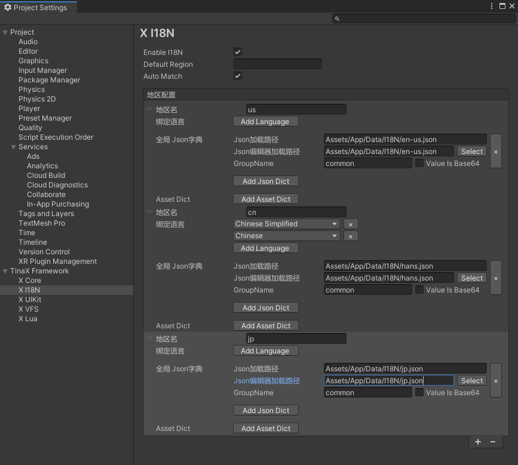

因为本案例使用了`TinaX.VFS`来管理加载资产，所以我们还需要将Json文件所在的路径添加到可被VFS框架管理的白名单中

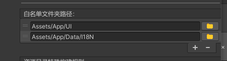

最后重新运行，我们可以观察到I18N框架依然如之前一样正常运行。