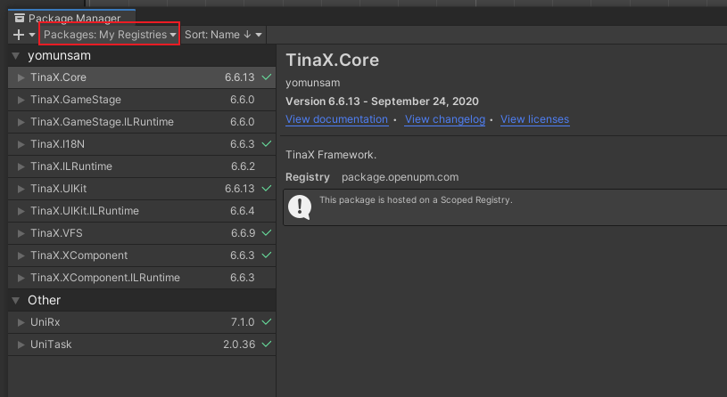
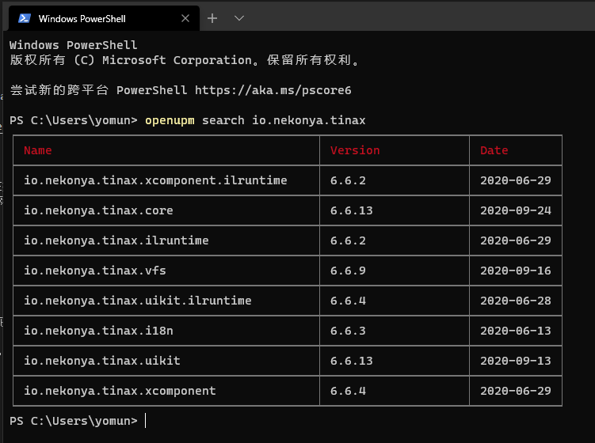
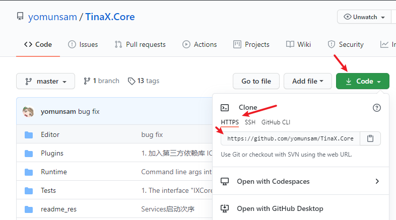
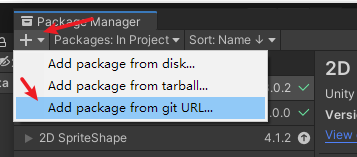
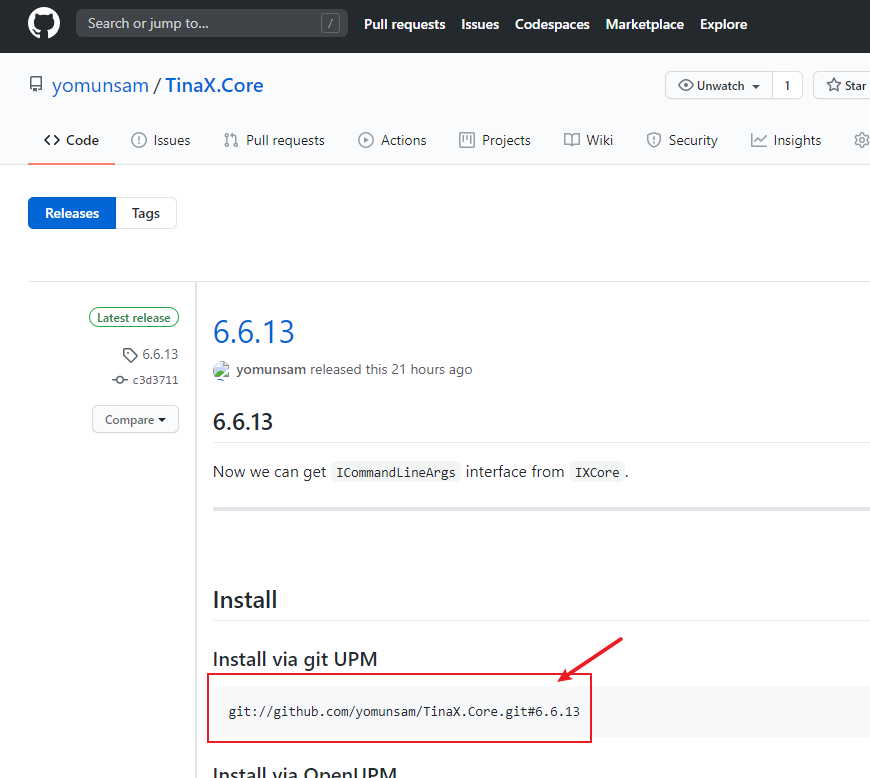
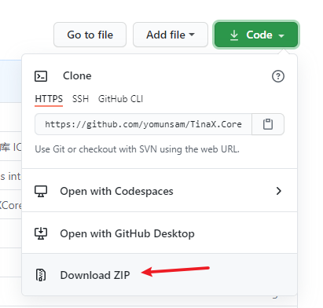

# 在项目中安装TinaX

TinaX基于Unity Packages发布内容，我们可通过如下方式将其添加到我们的项目中：

- [通过UPM (Unity Package Manager)安装](#通过UPM安装)
- 通过OpenUPM工具安装
- 通过git url 安装
- 通过本地文件安装

其中，通过npm/OpenUPM安装是推荐的方式。

<br>

## 通过UPM安装

在您的Unity项目中的`Packages/manifest.json`文件中，添加如下内容：

``` json
"scopedRegistries": [
    {
        "name": "TinaX",
        "url": "https://registry.npmjs.org",
        "scopes": [
            "io.nekonya"
        ]
    },
    {
        "name": "package.openupm.com",
        "url": "https://package.openupm.com",
        "scopes": [
            "com.cysharp.unitask",
            "com.neuecc.unirx"
        ]
    }
],
```

然后，您可以在Unity的Package Manager窗口中操作TinaX的各Packages.



<br>

- 该方法是完全Unity原生支持的方式，团队中的合作者在打开工程时不需要额外的操作。
- 如果开发者处于特殊地区，对npmjs的registry服务器网络不通畅的话，可以将上述配置中的`"url": "https://registry.npmjs.org"` 替换成 `"url": "https://registry.npm.taobao.org"` （淘宝NPM镜像）

<br>

<br>

## 通过OpenUPM方式安装

OpenUPM是开源社区针对Unity包管理工具的第三方扩展，它包括了OpenUPM命令行工具、OpenUPM自己的NPM Registry服务器等内容。

使用OpenUPM前，我们需要安装node.js和npm工具，之后，我们可以在命令行中安装OpenUPM的命令行工具：

``` bash
# Install openupm-cli
npm install -g openupm-cli
```

当安装命令行工具后，我们可在Unity工程的根目录下运行命令来向项目中添加包：

``` bash
openupm add 包名

# 例如安装TinaX.Core包
openupm add io.nekonya.tinax.core
```

我们可以使用`openupm search io.nekonya.tinax`命令来搜索所有TinaX相关的、存在于OpemUPM服务器中的包：


OpenUPM中的包通常是与Npmjs Registry服务器中同步的。

?> TinaX的第三方依赖`UniRx`和`UniTask`并没有发布到npmjs registry，所以实际上即使是直接使用UPM安装包的时候，我们的配置中依然是使用了OpenUPM的服务器来安装这两个依赖的。<br>如果您处于对OpenUPM网络不畅通的特殊地区，也可以选用其他方式单独安装这两个依赖包。UPM不限制只能使用同一种方式来安装Packages,只要包名一致且版本合适就不会存在依赖问题。

<br>

<br>


## 使用Git Url安装

当我们点进相应的Packages的Github页面时，我们可以获取到该仓库的git地址



将该地址复制后，可在UPM界面的左上角菜单中选择通过git url安装




> 对于访问GitHub较为困难的特殊地区，我们可以使用TinaX在Gitee的镜像仓库的git url进行安装。

> 使用Git方式安装需要事先安装`git`命令行工具，且同团队内**所有**需要打开该Unity工程的合作者都安装`git`命令行工具。

> 使用Git方式安装需要手动管理依赖，比如`TinaX.Core`包依赖`UniRx`和`UniTask`包，则需要先安装`UniRx`和`UniTask`包之后才能安装`TinaX.Core`包。

### 通过Git安装指定版本的包

我们可以通过在git url后加`#版本号`的形式安装指定版本的TinaX包。

例如使用`git://github.com/yomunsam/TinaX.Core.git#6.6.13`指定安装版本号为`6.6.13`的`TinaX.Core`包。

这个版本号本质上是Git的Tag，我们可以在对应仓库的页面中查看Tag信息，或者在Release页面中直接复制Url:




<br>

<br>


## 通过本地文件安装

此外，我们也可以通过纯离线的方式使用文件安装Packages.

在对应包的仓库主页中，我们可以直接把整个包下载到本地：



然后从Unity的UPM界面中添加本地的包即可。