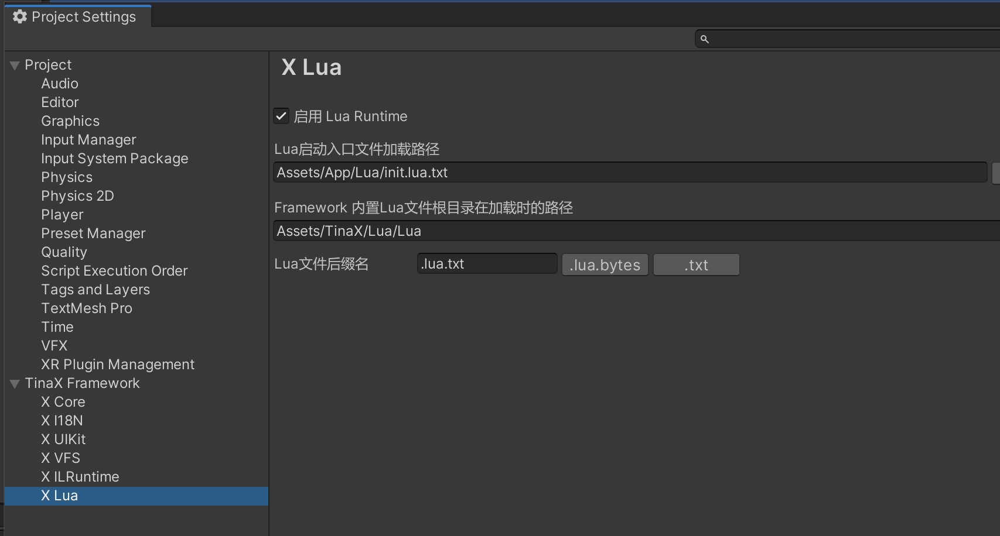

# TinaX.Lua

`TinaX.Lua`是TinaX Framework的Lua语言扩展。该部分基于`Tencent/xLua`。

项目主页：[https://github.com/yomunsam/TinaX.Lua](https://github.com/yomunsam/tinax.lua)

## 开始使用Lua

### 导入到工程

TinaX.Lua功能并非以包(package)的形式提供，而是需要我们手动将项目导入到我们的工程的`Assets`目录中。

从项目主页下载全部文件，或使用`git clone`，放置在工程的`Assets`目录即可。

通常，我们建议将其导入到路径：`Assets/TinaX/Lua`

<br>

### 服务提供者

TinaX.Lua需要我们向`TinaX.Core`包的`XCore`注册服务提供者，服务提供者是位于`TinaX.Lua`命名空间的`LuaProvider`类。

``` csharp
using TinaX; //XCore所在命名空间
using TinaX.Lua; //Lua服务提供者所在命名空间

var core = XCore.New()
    .RegisterServiceProvider(new LuaProvider()); //注册服务提供者
_ = core.RunAsync();
```

<br>

### 配置项目

在Unity 编辑器的Project Settings面板中，我们可以找到Lua相关设置项。



TinaX.Lua自身包含了部分Lua文件，需要在服务启动时启动它们。这部分Lua文件位于TinaX.Lua项目的`Lua`文件夹中。

而由于实际上我们可以把TinaX.Lua相关内容导入到任何位置，所以我们需要在设置中指定它们的根目录的加载路径。

?> 在TinaX官方示例中，我们使用[TinaX.VFS](https://github.com/yomunsam/TinaX.VFS)作为来实现框架内置的资源加载接口，所以示例中的加载路径使用的是"Assets/xxx/xx.xxx"这种`VFS`约定的路径格式。如果您使用其他服务来实现框架内置的资源接口，则配置的加载路径可能与之不同。

<br>

### 框架内置资源接口

TinaX.Lua自身不管理和加载项目中所需的Lua文件，而是调用框架内置的资源接口来加载和卸载lua文件。这意味着：

1. 请确保包括TinaX.Lua自带Lua文件在内的所有Lua文件都在实现了框架内置资源接口的服务的资源管理范围内。（比如使用TinaX.VFS的话，请把包括TinaX.Lua自带的Lua文件在内的所有Lua文件添加进VFS的资源管理白名单）
2. 框架启动时，必须有服务实现了框架内置资源接口，且该服务的启动次序应该在TinaX.Lua之前（即启动次序小于`100`). （比如直接使用TinaX.VFS即可。）

详请阅读文档：[内置资源接口](/cmn-hans/core/manual/IAssetService)