# 快速上手：从Hello World说起

?> 您可在此查看该部分内容的源码: [E01_HelloWorld_CSharpOnly](https://github.com/yomunsam/TinaX/tree/TinaX6.6/Examples/E01_HelloWorld_CSharpOnly ':target=_blank')

在本部分，我们来尝试使用TinaX制作一个Hello World窗口.

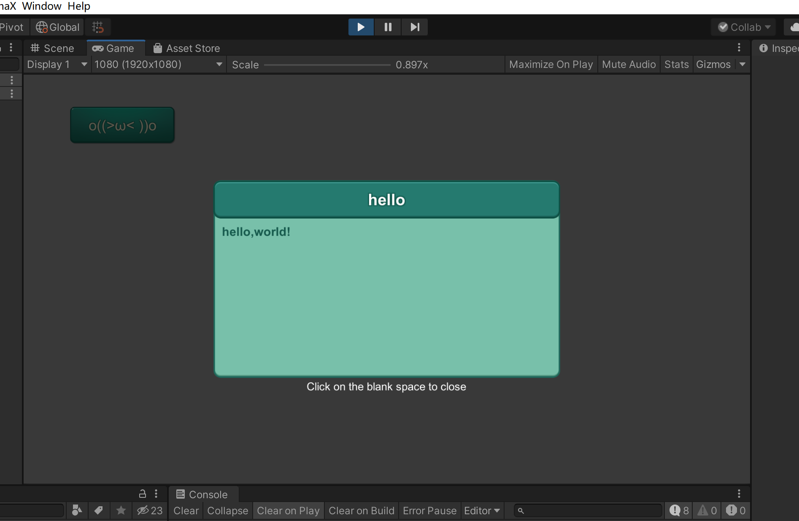


## 导入包

需要实现这样一个效果，我们需要导入一些TinaX的包：

**`TinaX.Core`** ：Core包是TinaX一切的基础，不管我们要做什么，首先都得导入它。

我们可以在该包的**[仓库页面](https://github.com/yomunsam/TinaX.Core)**中看到该包的地址和*依赖信息*。

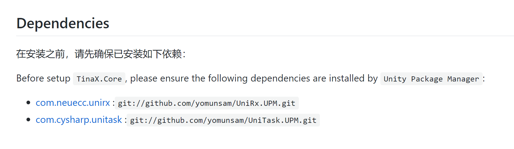

我们看到，`TinaX.Core`包依赖了`UniRx`和`UniTask`两个包。而在导入`TinaX.Core`包之前，我们就一定得先导入这两个依赖包。

?> 由于`UniRx`和`UniTask`目前官方并未提供UPM包，因此目前文档中给出的包是TinaX的作者自己做的。

“包”的概念是近期Unity新增的内容，对于不少开发者来说，可能还是比较陌生的。那么，我们要如何把包导入到我们的项目中呢？

这里介绍两个方法：`使用Git` 和 `直接导入文件`

首先，我们先按下图所示，在Unity的菜单中`Window->Package Manager`项中打开UPM面板。

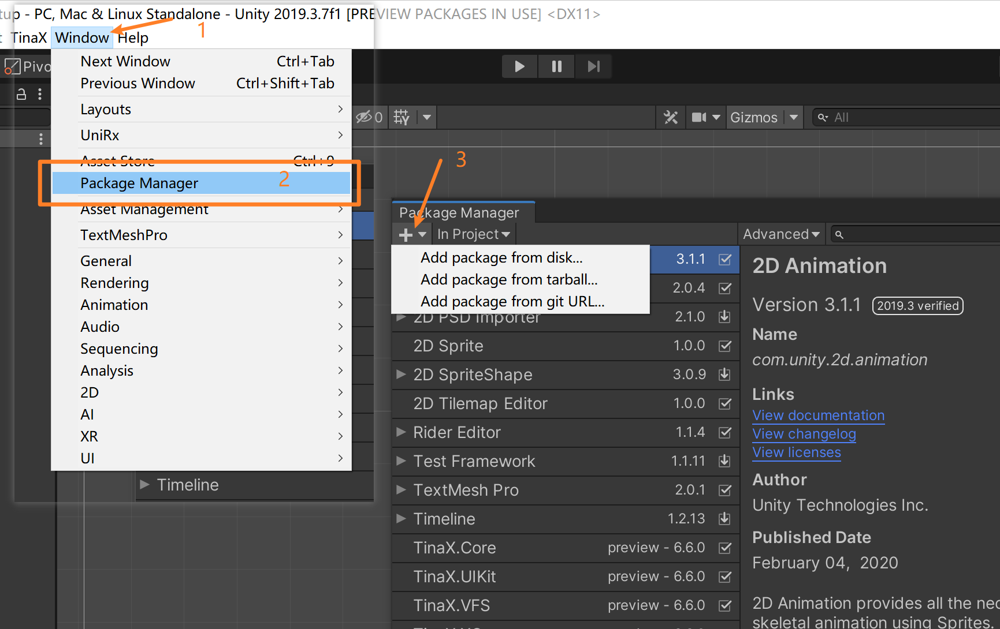

#### 使用Git

在TinaX相关包的仓库页面中，我们可以找到该包及其对应依赖的*Git地址*。

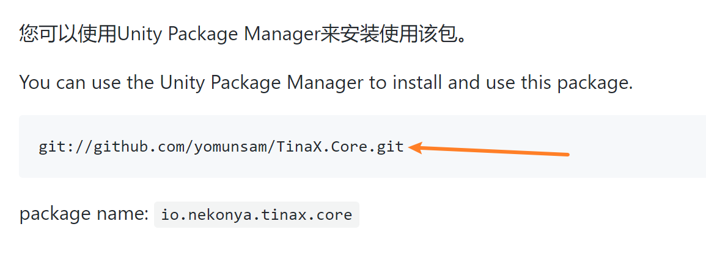

将该地址复制后，点击之前打开的UPM面板左上角的加号按钮，选择`Add package from git URL`项，粘贴地址，点击“Add”按钮之后稍等片刻，添加成功。(注意粘贴的地址中不要有多余的空格)

之后，我们会在UPM面板中观察到我们需要的包已经被导入到项目中

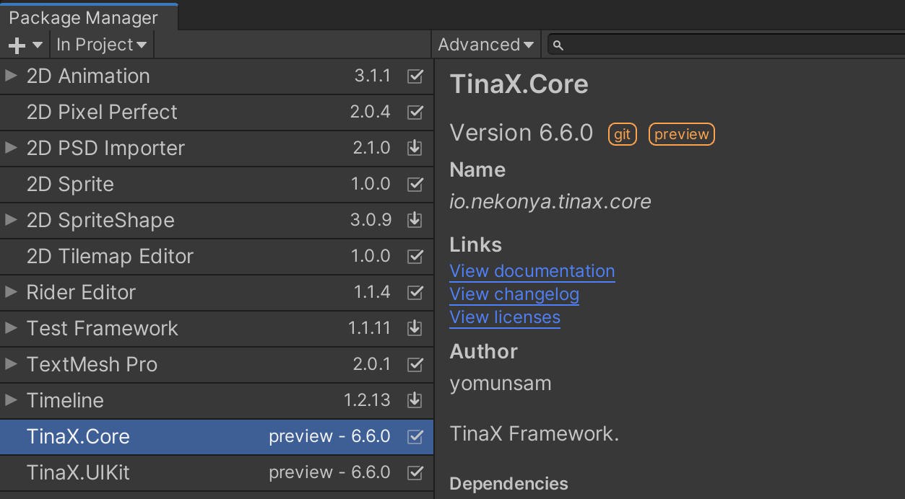

!> 不过要注意的是，使用Git方式导入包，需要您的电脑已安装并可正常在命令行中使用git, 如果不具备相关条件，可使用直接导入文件的方式添加包。

?> 在多人协作的项目中，我们推荐使用git方式或openupm方式来使用package.

#### 直接导入文件

在相关包的仓库页面，我们可以找到“Clone or download”按钮，这样我们就可以把包下载到本地。

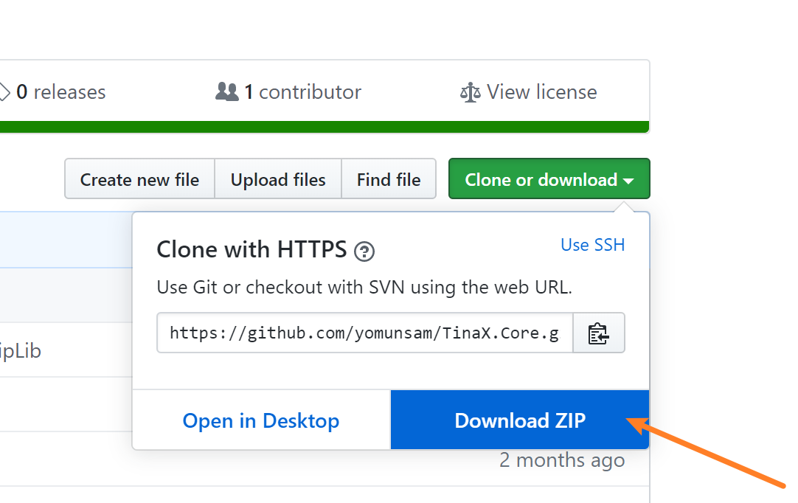

解压下载到的包文件后，在我们之前打开的UPM遍布的左上角点击加号按钮，选择Add package from disk的方式添加即可。

### 需要导入

在本Demo中，我们一共需要导入以下包： 

- **[UniRx](https://github.com/yomunsam/UniRx.UPM)** : `git://github.com/yomunsam/UniRx.UPM.git` 第三方依赖
- **[UniTask](https://github.com/yomunsam/UniTask.UPM)** : `git://github.com/yomunsam/UniTask.UPM.git` 第三方依赖
- **[TinaX.Core](https://github.com/yomunsam/TinaX.Core)** `git://github.com/yomunsam/TinaX.Core.git` TinaX的核心库
- **[TinaX.VFS](https://github.com/yomunsam/TinaX.VFS)** `git://github.com/yomunsam/TinaX.VFS.git` TinaX的资源管理服务包
- **[TinaX.XComponent](https://github.com/yomunsam/tinax.XComponent)** `git://github.com/yomunsam/TinaX.XComponent.git` TinaX中UIKit的依赖包
- **[TinaX.UIKit](https://github.com/yomunsam/TinaX.UIKit)** `git://github.com/yomunsam/TinaX.UIKit.git` TinaX中的UI服务

<br>

## 启动TinaX

导入了相关包之后，我们来启动TinaX吧。

首先，我们创建一个C#代码文件，编写代码如下：

``` csharp
using TinaX;
using TinaX.UIKit;
using TinaX.VFSKit;
using UnityEngine;

namespace Nekonya.Example
{
    public class AppStartup : MonoBehaviour
    {
        private void Start()
        {
            var core = XCore.New() //实例化Core对象
            .RegisterServiceProvider(new VFSProvider()) //注册服务提供者：VFS
            .RegisterServiceProvider(new UIKitProvider()) //注册服务提供者： UIKit
            .OnServicesStartException((service, err) =>
            {
                //接收服务们启动的时候的异常报错信息
            });
            _ = core.RunAsync(); //启动Core
        }
    }
}
```

在上面的代码中，我们编写了一个组件（继承自MonoBehaviour)，在Start方法被执行的时候，实例化`XCore`对象，并且把`VFS`和`UIKit`两个服务的`服务提供者`注册给`XCore`对象。

在最后的`RunAsync`方法，我们真实开始启动TinaX（Core）。

这里需要注意的是，上述代码案例中，`RunAsnc()`是一个返回`Task`的异步方法。如果用上述写法丢弃Task的话，启动过程中若是有某个部分抛出异常，是不会被Unity捕获的。（体现为Unity没有任何报错，但是突然中断了）

如果我们希望让Unity捕获启动时的异常，最后的写法应该改为

``` csharp
await core.RunAsync();
```

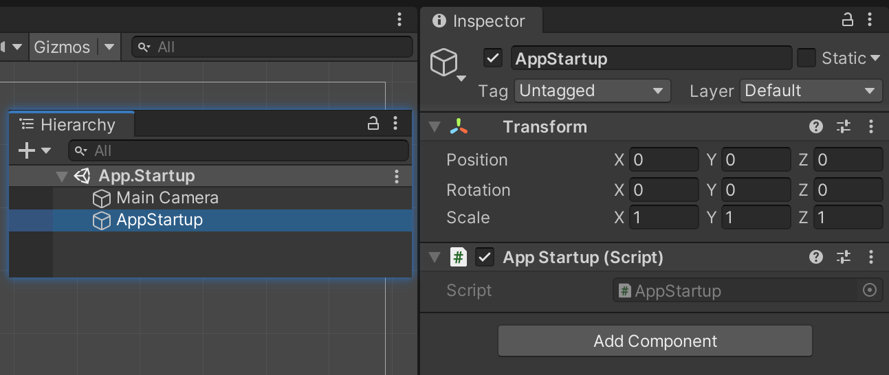

最后，我们把写好的组件挂载到场景中某个`GameObject`上，就完成了TinaX的启动工作。


## 跟随TinaX的生命周期

我们推荐的最佳实践是，所有的业务逻辑应该在框架启动后进行。

要实现这一点，最简单的方法就是在`await core.RunAsync();`之后再写业务代码的初始化逻辑。

这当然是可行的，不过在这里，我们推荐使用另一种做法：

``` csharp
using TinaX;
using TinaX.VFSKit;
using TinaX.UIKit;

namespace Nekonya.Example
{
    public class AppBootstrap : IXBootstrap
    {
        public void OnInit(){}

        public void OnStart(){}

        public void OnQuit(){}

        public void OnAppRestart(){}
    }
}
```

如上所示，我们编写了一个新的`class`，继承自`TinaX`命名空间下的`IXBootstrap`接口，并实现了接口中的四个方法。

在TinaX启动时，会反射出当前`Domain`下所有继承自`IXBootstrap`接口的类，并在恰当的时机调用对应的方法。

我们重点看`OnInit`和`OnStart`方法：

**`OnInit`**: 当`OnInit`方法被调用时，所有注册给`XCore`的服务（`Services`）已经完成了初始化和服务注册，这意味着从`OnInit`开始，我们已经可以从`XCore`中获取到之前注册的服务的对象，**但此时服务还没有启动**，这意味着我们不可以在这时调用服务中的大部分接口方法。

举个例子：我们可以在`OnInit`阶段拿到资源管理服务`VFS`的服务对象接口`IVFS`，这时候我们可以设置`IVFS`对象里的一些内容，比如设置VFS以何种方式加载资源、下载资源等等。但是由于这时候VFS并没有真正启动，所以我们无法调用`LoadAsset`方法来加载资源。（当然，具体到每个服务中，哪些部分可以在启动前调用，哪些部分必须在服务启动后调用，请看对应服务的文档。）

**`OnStart`**: 当`OnStart`服务被调用时，XCore中所有的服务均已启动完成，或者我们可以理解为，整个TinaX都已启动完成。也就是说，我们可以用`OnStart`作为业务逻辑开始的入口。


## 开始制作UI吧

首先，为了项目的规范，我们在工程中专门建立一个文件夹，用于存放UI相关内容（名称随意）

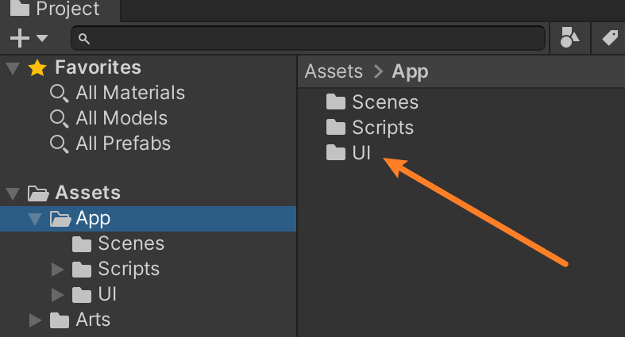

然后，我们在工程里右键，选择菜单`Create->TinaX->UIKit->UI Group`来创建一个UI组

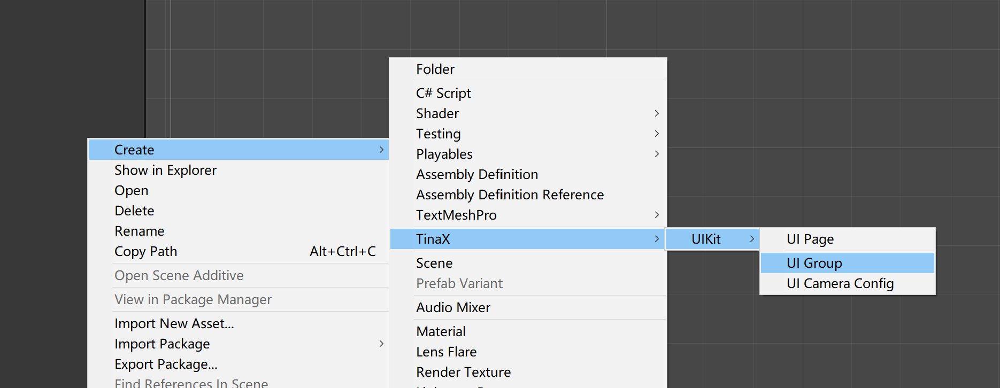

并以通样的方法，菜单`Create->TinaX->UIKit->UI Camera Config`来新建一个`UICamera的配置信息`

完成了上述工作之后，我们开始创建我们的第一个UI, 右键菜单: `Create->TinaX->UIKit->UI Page`创建一个UI页，如下图：

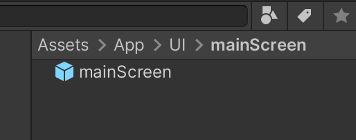

我们发现，UI Page本质上是一个Prefab文件，它在UIKit中代表了一个UI的基本单位，我们可以称之为“一页”或者“一个UI”.

双击打开，然后我们就可以用通常使用UGUI的方式来编辑一页UI了

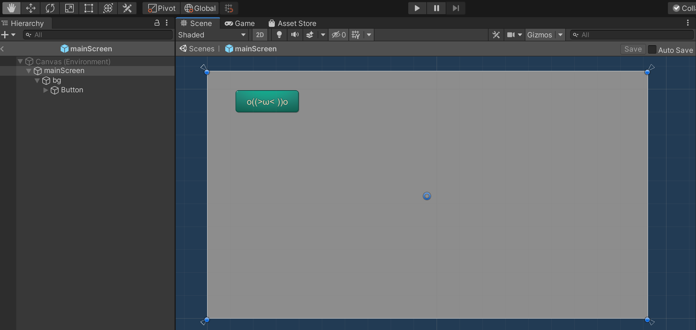

如上图，我们在UI中放置了一个按钮，待会我们要实现“点击这个按钮，弹出另一个UI”的功能。

使用同样的方法，我们制作了第二个UI. 也就是我们第一页UI上点击那个按钮之后要弹出的内容。

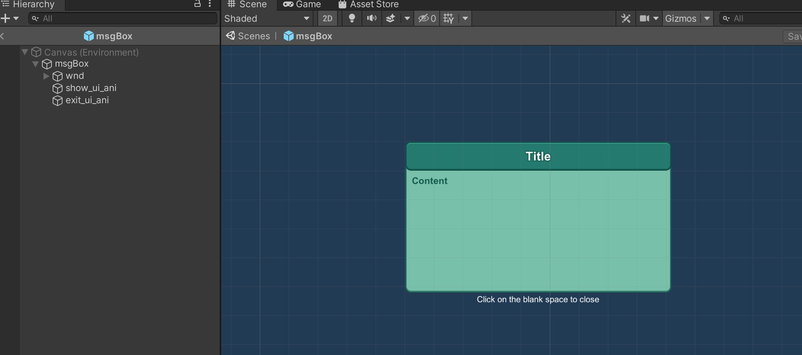

### UI Page

选中UI的跟节点，我们会发现，它挂在了一个`UI Page`组件，这里，我们得稍微聊聊UI Page中的“UI处理者”了。

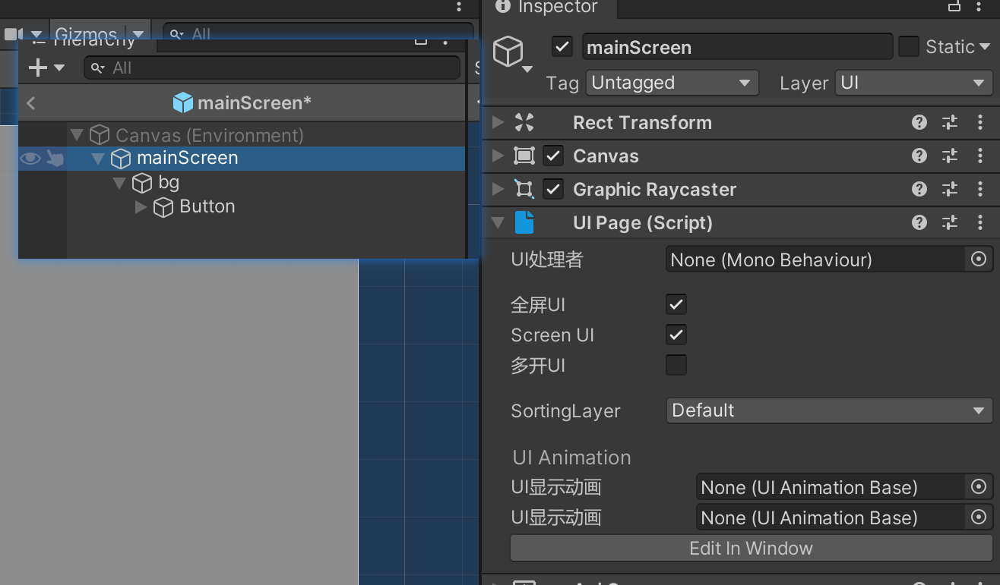

**`UI处理者`**：在我们通常使用UGUI的时候，我们总得写一些组件挂在UI上来处理一些逻辑。而`UI处理者`就是指这些逻辑的“老大”，在UIKit中，我们约定“UI处理者”会管理整个`UI Page` Prefab.

这里原则上我们随便写一个组件拖进去就新了。但是在本例中，我们介绍一个新的组件：`XComponent`


### XComponent

`XComponent`组件的官方定义描述的作用是：让组件从`MonoBehaviour`中解耦出来。

我们平时是怎么写组件的呢，比如这样：

``` csharp
public class Meow: MonoBehaviour
{
    public Text txt_title;
    
    void Start()
    {
        txt_title.text = "hello world";
    }
}
```

在这段代码中，继承自父类 `MonoBehaviour` 是为了告诉Unity：我这写的是个组件，可以在编辑器里挂在到GameObject上。

`txt_title`这个公开变量是告诉Unity：我们可以在编辑器里拖拽一个`Text`对象绑定给这个变量。

上面这部分我们可以*粗略*的认为它是“一个组件的编辑器”部分，而`Start`方法的部分，我们可以认为它是组件的逻辑部分。

而`XComponent`，就是为了让“编辑器部分”和“逻辑”部分分开而诞生的。


#### 那，为什么要分开？

为了热更新。

在市面上几乎所有的可热更新方案中，都不推荐对`MonoBehaviour`进行热修补。所以，最佳方法就是，把MonoBehaviour从你的组件中抽出来。

?> 当然，你要是完全不考虑热更新的问题，就压根不用管`XComponent`是个啥。

我们往UIPage的根节点上添加一个`XComponent`组件。

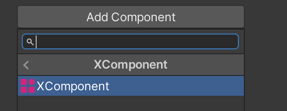

并将其设置为UIPage的“UI处理者”

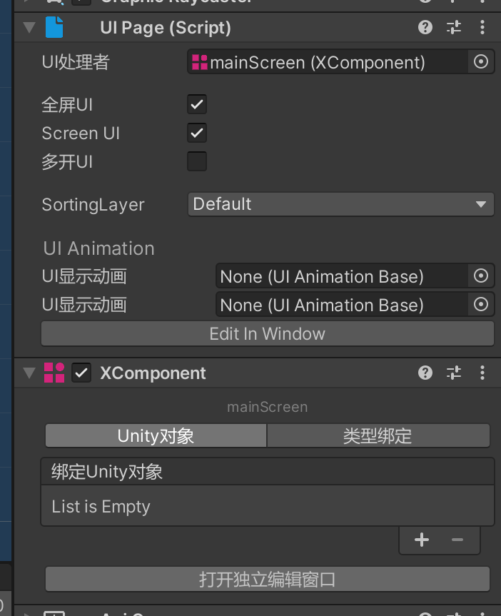

然后，我们需要实现“点击UI上的按钮，打开另一个UI”的功能，这意味着，我们需要把UI的按钮，绑定给组件`XComponent`

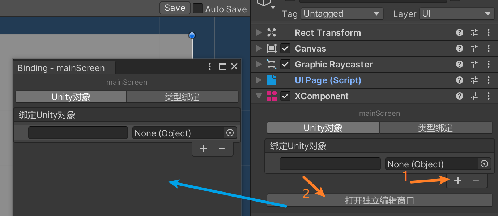

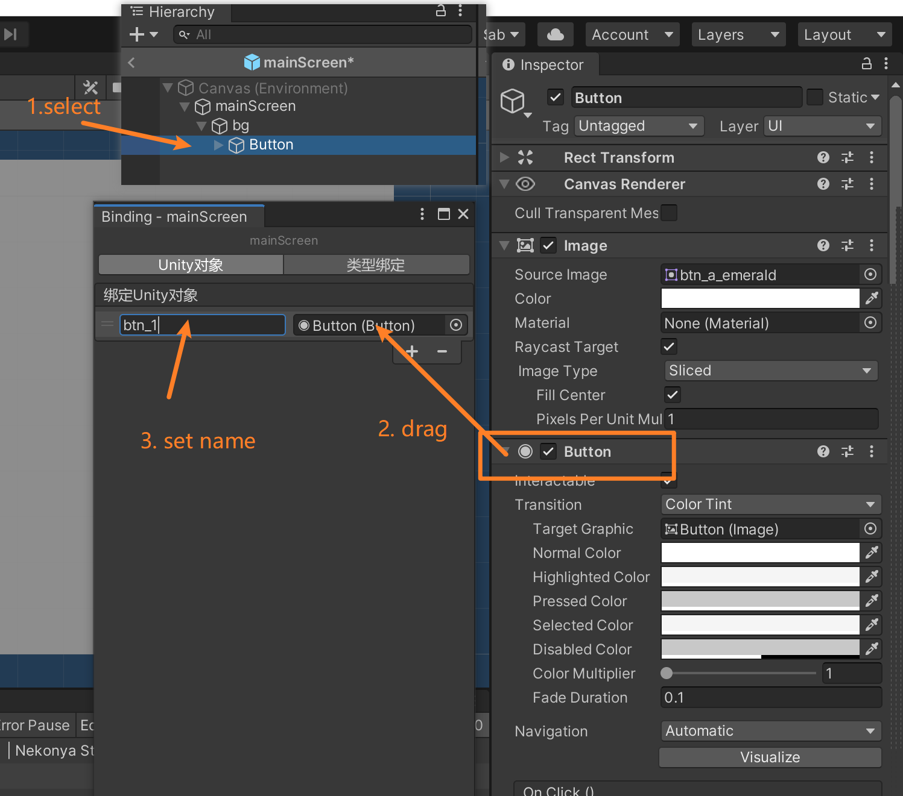

接下来我们就开始写代码吧

新建一个新的C#代码文件如下：

``` csharp
using System.Threading.Tasks;
using TinaX;
using TinaX.UIKit;
using TinaX.XComponent;
using UnityEngine.UI;

namespace Nekonya.Example
{
    public class MainScreen : XBehaviour
    {
        [Inject]
        public IUIKit _UIKit { get; set; }
        public Button btn_1 { get; set; }

        public override void Start()
        {
            btn_1.onClick.AddListener(async () =>
            {
                await _UIKit.OpenUIAsync<MsgBox>("msgBox", 
                    new OpenUIParam() { UseMask = true, CloseByMask = true }, 
                    "hello,world!", "hello");
            });
        }
    }
}

```

在上述代码中，class `MainScreen`继承自`XBehaviour`，这是一个与`MonoBehaviour`无关的纯粹的class，

然后我们声明了两个属性（`property`）`_UIKit` 和 `btn_1`.


其中，`_UIKit`的类型是`UIKit`的服务接口，所有TinaX的服务，都可以被自动赋值（依赖注入），

而`btn_1`由于和之前绑定在`XComponent`组件中的绑定的按钮的“绑定名”一致，所以可以被自动赋值（依赖注入）。

下面的`Start`方法重写自父类`XBehaviour`，用法与`MonoBehaviour`的`Start`一致。

在`Start`中，我们调用了`OpenUIAsync`方法，该方法的原型是:

``` csharp
Task<IUIEntity> OpenUIAsync<T>(string UIName, OpenUIParam openUIParam, params object[] args) where T : XBehaviour
```

<br>

返回值是一个可以操作该UI的接口，我们先不用管。

参数`UIName`是代表UI的名字，我们暂时不管，后面再说。

参数`OpenUIParam`提供了打开UI的一些特殊参数，我们这里用到的参数是`UseMask` “使用UI遮罩”, 和`CloseByMask` “可点击遮罩区域关闭”。

我们看本例最开始的效果图，当我们打开“msgBox”这个UI时，UI后面的背景变暗了，这个就是UI遮罩效果，而“点击空白处关闭窗口”的功能，就是“CloseByMask”的效果。

泛型参数`MsgBox`传递的是一个继承自`XBehaviour`的类，它和我们当前正在写的`MainScreen`类是一样的，`MsgBox`类负责另一个UI“MsgBox”的逻辑内容。

`MsgBox`类的代码如下：

``` csharp
using TinaX.XComponent;
using TinaX.UIKit;
using UnityEngine.UI;
using UnityEngine;

namespace Nekonya.Example
{
    public class MsgBox : XBehaviour
    {
        [Binding("txt_title")]
        public Text mTitle { get; set; }
        [Binding("txt_content")]
        public Text mContent { get; set; }

        public override void OnMessage(string msgName, params object[] msgParams)
        {
            switch (msgName)
            {
                case "OnOpenUIMessage":
                    OnOpenUIMessage(msgParams);
                    break;
            }
        }

        private void OnOpenUIMessage(params object[] args)
        {
            if (args == null) return;
            if (args.Length == 1)
                mContent.text = (string)args[0];
            else if(args.Length > 1)
            {
                mContent.text = (string)args[0];
                mTitle.text = (string)args[1];
            }
        }
    }
}
```

这段代码中的`mTitle`和`mContent`给我们展示了组件绑定的另一种写法：不必让属性名和XComponent中绑定的名字完全一致，而是用`Binding`这个`attribute`描述XComponent中绑定对象的名字。

并且这段代码中，我们发现它用`OnMessage`方法接收了一个`OnOpenUIMessage`的消息，这里对应的就是之前"OpenUIAsync"方法中，最后传递的两个字符串`"hello,world!", "hello"`.

为什么我们的MsgBox类可以收到`OnOpenUIMessage`消息呢？这是因为我们一开始做的工作：“把XComponent设置为`UIPage`的UI处理者”

就像我们之前所说的，“UI处理者”被约定为是管理整个UI的“老大”，UI处理者可以接收到“打开UI时传递的参数”、“关闭UI时传递的参数”、“UI动画播放结束的事件”等等消息。

?> 如果UI处理者 被设置为一个普通的MonoBehaviour的话，UIKit会尝试通过Unity的`SendMessage`方法来发送消息。


<br>


那接下来，我们在最开始提到的`AppBootstrap`类的`OnStart`方法里，写上打开“mainScreen”这个UI的方法，代码部分就到此结束了

``` csharp
public async void OnStart()
{
    //open ui
    var uikit = XCore.MainInstance.GetService<IUIKit>(); //从XCore的全局单例中获取UIKit服务的接口
    await uikit.OpenUIAsync<MainScreen>("mainScreen"); 
}
```

在这里的`OpenUIAsync`的方法原型和上面有点不一样了，不需要传递`OpenUIParam`:

``` csharp
Task<IUIEntity> OpenUIAsync<T>(string UIName, params object[] args) where T : XBehaviour
```

<br>

<br>

## 最后的设置

等等，刚刚一直有个事被我们忽略了：打开UI的方法里，“UIName”这个名字到底是哪来的，UIKit怎么直到我们要打开的UI叫啥名字呢？

### UI Name

这其实是要我们设置一下的。

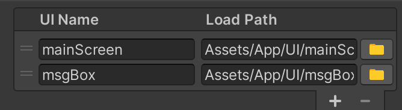

找到我们一开始创建的“UI Group”，分别设置UI Name 和 Load Path，就有了。


### UIKit ProjectSetting

那么UIKit又是怎么知道我们要用哪个UI组呢？还得再设置一下：

打开Unity编辑器的Project Settings 面板 （菜单`Edit-> Project Settings`)，找到`TinaXFramework -> X UIKit`设置项。

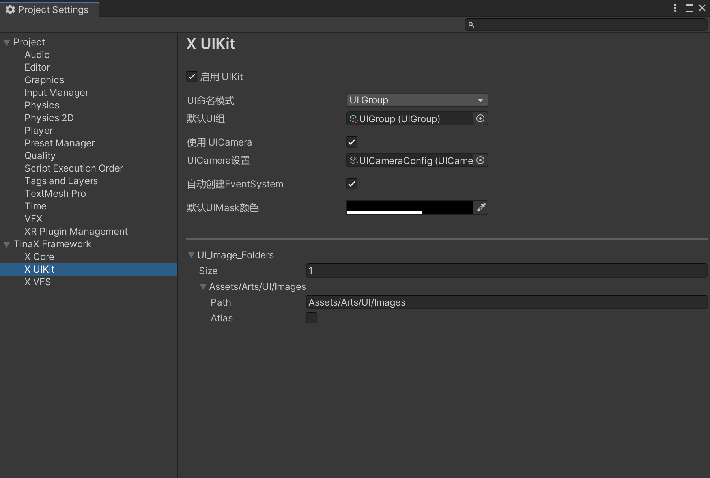

勾选“启用UIKit”，设置“UI命名模式”为使用UIGroup，并把我们刚刚的UI Group设置进去。

勾选“使用UICamera”, 并把我们一开始的创建的`UI Camera Config`设置进去，

（下方的“UI Image Folders”的用途是，编辑器下我们把图片文件导入进Unity的时候，设定目录中的图片文件会自动设置成`Sprite`格式。一个单纯的编辑器功能，没其他作用）


那么这时候是不是就完事了呢，我们运行一下看看，报错了：

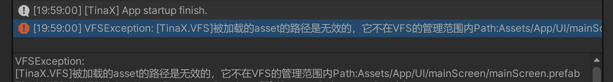


### VFS 

UIKit打开UI的本质是在加载Prefab，但是怎么加载Prefab呢？当然就是VFS要干的活了，不然我们一开始把VFS导入进工程干嘛。

所以，我们还得再设置一下VFS, 把我们一开始存放UI的那个目录，添加进VFS的白名单即可。

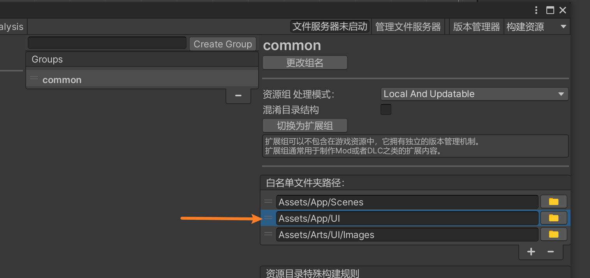


然后再次运行，我们发现UI被成功的按照预期打开了。

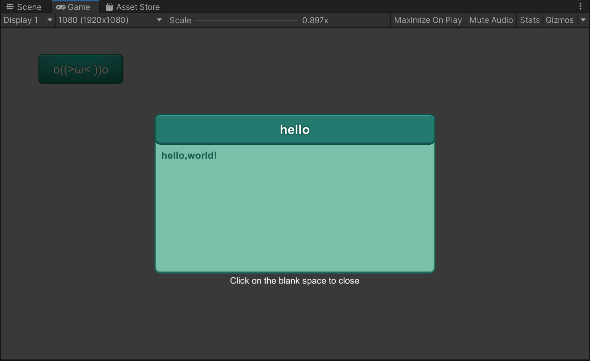


**完**


<br>

<br>

<br>

## 多说一句

照理说， `UIKit`并没有依赖`VFS`，那`UIKit`是怎么利用VFS来加载UI资源的呢？

这是因为，在`TinaX.Core`中，定义了一些非常常用的基础服务接口，比如`UIKit`用来加载资源的是接口是`TinaX.Services.IAssetService` 内置接口。（TinaX几乎所有的包都有依赖这个接口）

而VFS在提供自身的`IVFS`服务接口的同时，也顺便实现了内置接口`IAssetService`.

这意味着：如果我不想用VFS的话，其实也可以自己写一个Service并注册实现`IAssetService`接口，然后就可以替换掉VFS了。

其他地方也是同理。