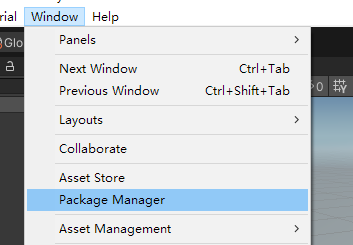
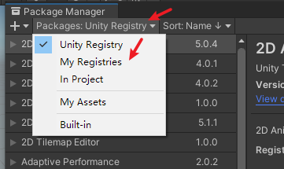
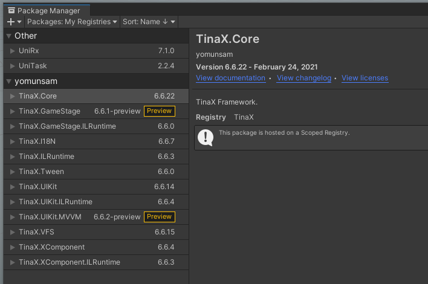
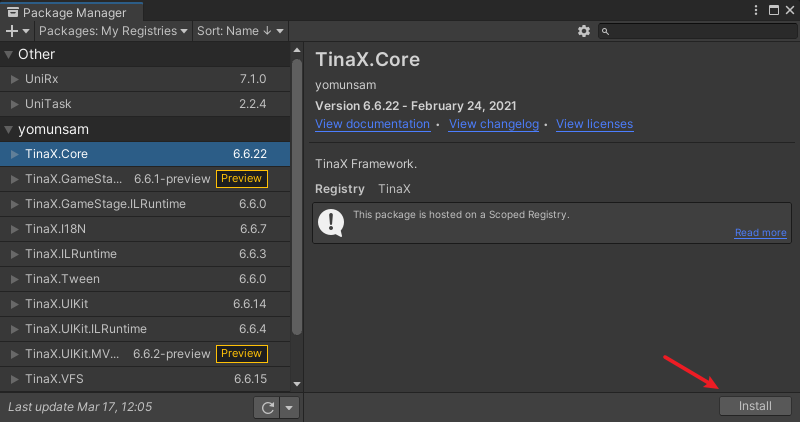
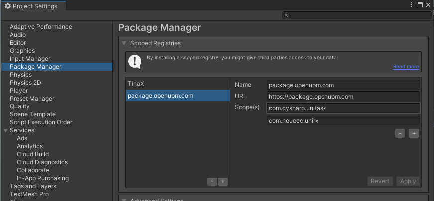
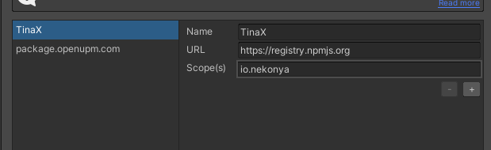

#  通过UPM安装TinaX

Unity Package Manaer (UPM)是Unity自`2018.1.x`版本开始提供的新的包管理工具，借助UPM，我们可以更有条理的管理项目中引用的第三方包（库），而无需将其导入到`Assets`文件夹中。

我们可以访问[UPM的官方文档](https://docs.unity3d.com/Manual/Packages.html)了解更多信息。

## 先决条件

Unity Package Manaer是自`Unity 2018.1.x`版本开始提供的内容，而TinaX的官方最低兼容版本是`Unity 2019.4` LTS.


## 修改manifest.json

?> 对于Unity 2020及以上版本，我们也可以不使用下述修改配置文件的方式，详见[相关说明](#对于Unity2020及以上版本)

打开您的Unity项目中的`Packages/manifest.json`文件，添加如下内容：

``` json
"scopedRegistries": [
    {
        "name": "TinaX",
        "url": "https://registry.npmjs.org",
        "scopes": [
            "io.nekonya"
        ]
    },
    {
        "name": "package.openupm.com",
        "url": "https://package.openupm.com",
        "scopes": [
            "com.cysharp.unitask",
            "com.neuecc.unirx"
        ]
    }
],
```

之后我们可以通过编辑器菜单`Windows > Package Manager`打开包管理UI:



并切换显示“My Registries”



我们可以看到TinaX相关的各个包：



选中对应包，点击“Install”即可安装



<br>

## 对于Unity2020及以上版本

对于Unity 2020及以上版本，我们可以不需要手动修改`manifest.json`文件，而直接在`Project Settings`窗口的`Package Manager` 项目中添加如下图所示的配置项。





<br>

## UPM和OpenUPM

我们观察到，在单纯的使用UPM方式安装包时，TinaX使用了`npmjs`的registry, 而与此同时依然使用了OpenUPM相关的registry.<br>
这是因为TinaX的部分功能依赖的第三方包`UniRx`，官方并未将其发布到`npmjs`的registry,而只在OpenUPM发布。
本文所述的UPM安装方式可以与OpenUPM混用，并不会影响正常使用OpenUPM.

<br><br>

## 特殊地区使用指南

对于部分访问国际互联网有困难的中国大陆地区开发者，我们可以通过如下方式来优化我们的开发体验：

### npm淘宝镜像

我们可以将上文中的`https://registry.npmjs.org`替换为淘宝npm镜像registry地址：`https://registry.npm.taobao.org`

### OpenUPM大陆镜像

我们可以将上文中的`https://package.openupm.com`替换为OpenUPM大陆地区镜像registry地址：`https://package.openupm.cn`

<br>

即完全替换后的内容为:

``` json
"scopedRegistries": [
    {
        "name": "TinaX",
        "url": "https://registry.npm.taobao.org",
        "scopes": [
            "io.nekonya"
        ]
    },
    {
        "name": "package.openupm.cn",
        "url": "https://package.openupm.cn",
        "scopes": [
            "com.cysharp.unitask",
            "com.neuecc.unirx"
        ]
    }
],
```