# 快速上手 Console Hello World
Hello World 示例: 

?> 欢迎使用TinaX Framework! TinaX 可以帮助你构建现代PC、主机、移动端、AR、VR、电视游戏和应用。

## 先决条件

在开始之前，请确保你的开发环境已经准备好了 `Unity` 引擎、`Visual Studio` 或 `Visual Studio Code`.

TinaX 需要 Unity 2018.3以上版本，本文采用Unity 2019.1.x 演示。

> 本文默认读者已熟悉Unity引擎基本操作与开发方式。

## 第一步： 创建工程

使用通常的方式创建Unity空工程。

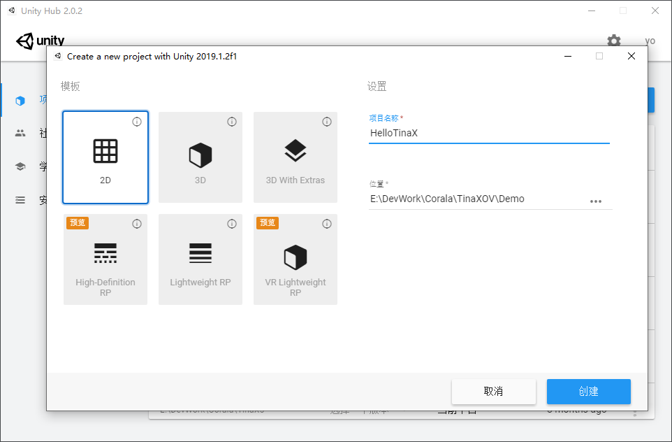

并打开Unity Editor.

## 第二步：下载TinaX Framework包并导入

您可以在TinaX的仓库的Releases页面下下载TinaX包：[TinaX 开源版 releases](https://github.com/yomunsam/TinaX/releases)

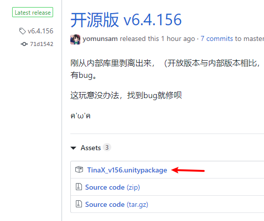

下载最新发布版本后，导入至Unity工程：

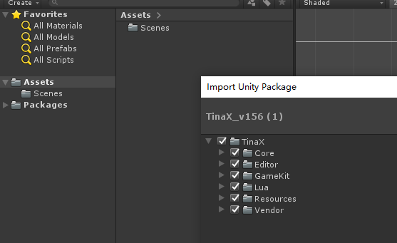

## 第三步：准备Hello World工程

#### 1. 准备工程结构

我们在Assets目录下新建目录”App“作为本次Hello World项目的资源存放根目录

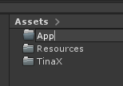

在App目录下新建目录“Scene”用于存放场景资源文件，并新建空场景“App.Startup”.

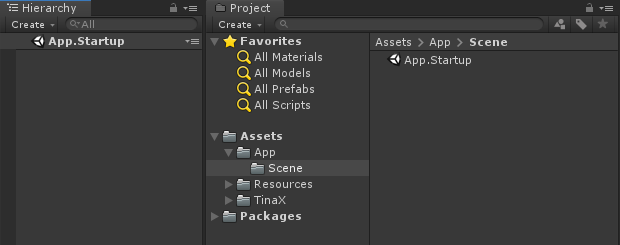

并将该场景添加到Unity "Build Settings" 的“Scenes In Build”列表中。

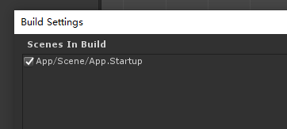

在App目录下新建目录“Script”用于存放C#代码，并新建代码文件“HelloWorld.cs”.

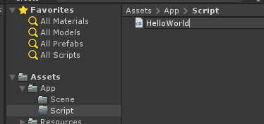

并编写代码如下。

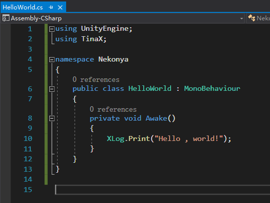

在"App.Startup" Scene中新建空GameObject, 并为其献上“HelloWorld”组件。

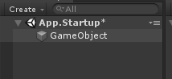

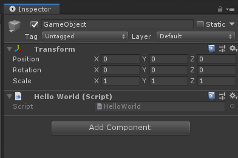

?> 到这一步为止，这和我直接拿Unity直接写个Hello World有个什么区别？(¬､¬)

#### 2. 初始化并设置TinaX

在Unity Editor窗口菜单（OSX / Ubuntu 为桌面顶部菜单） 中，选择“TinaX -> 框架 -> 初始化安装”，进行初始化。

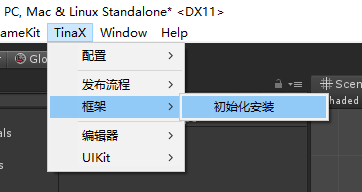

在弹出的窗口中点击“安装”，继续下一步：

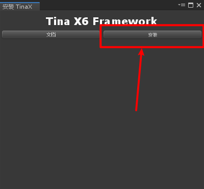

在本文Hello World示例中，我们不需要使用Lua语言，因此需要点击下图表示按钮**选择不启用Lua模块**。

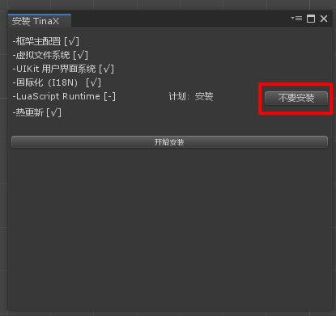

并点击下方按钮，完成Framework 初始化

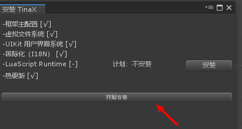

接下来，在Unity Editor菜单中选择项目设置（Edit -> Project Settings）

在设置窗口“TinaX Framework -> 基础设置” 中，将“是否启用TinaX Framework”选项勾选，并在“初始化启动场景中”填写刚刚创建的`App.Startup`

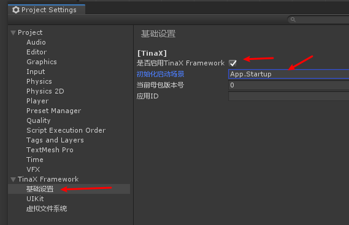

## 第四步：运行Hello World工程示例

点击Unity Editor窗口顶部的运行按钮，开始运行项目

观察到控制台输出了Hello World.

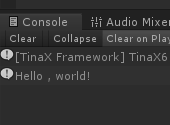

## 上述案例中，TinaX做了什么？

上述案例的操作过程非常简单，基本上只要熟悉Unity的人都能理解这是在干什么，但是很多人看完就有了疑问了：这和我直接拿Unity写个Hello World有个喵的区别？这框架有干什么事吗？

实际上，虽然不怎么明显，但是在这个案例中，我们看到了TinaX的第一个作用：

> 在游戏开始运行时，TinaX会在场景加载之前开始初始化，并始终以上述设置的“App.Startup”场景作为游戏的初始场景。

也就是说，无论你当前打开的是哪个场景，在点击运行时，TinaX都会让你的游戏从预先设置的“App.Startup”场景开始初始化整个游戏。

有过一定游戏开发经验的读者大概已经能明白这个设计的作用了：从统一入口开始初始化游戏，在上述案例中，`HelloWorld.cs`文件可以作为游戏的全局初始化入口来使用。

------

## 下一步

在控制台中输出hello world这种事，好像看起来没什么意思，下一步，我们试试利用TinaX Framework，在UI上显示hello world.

###  [ 2: 快速上手：UI Hello World ](/guide/quickstart/quickstart2)

