# 快速上手 ：UI Hello World 

UI Hello World 实例

?> 现在，我们要在  [快速上手：Console Hello World](/guide/quickstart/quickstart1)  的基础上干点更有“科技含量”的事情了

## UI目录

首先，我们在上篇“快速上手”的基础工程上，在“App”目录下新建一个目录“UI”，用来存放UI相关资源：

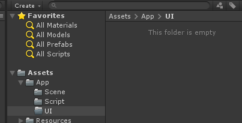


------

## UI文件

紧接着，我们在UI目录下创建一个新的目录“helloScreen”，用来存放我们的第一个UI.

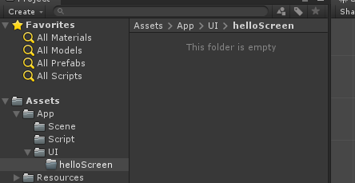

> 养成良好的工程结构整理习惯，比如我习惯于给每一类功能的UI新建一个子目录，如“helloScreen”。

在目录下使用右键菜单：“Create -> TinaX -> UI”新建一个UI文件，并命名为“helloScreen”.

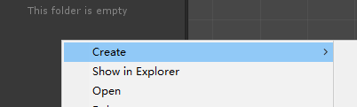

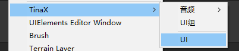

不难看出，熟悉的图标说明这个UI文件本质上是一个unity prefab： TinaX的UI服务基于uGUI和prefab。

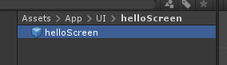

双击打开“helloScreen”UI文件，开始编辑UI

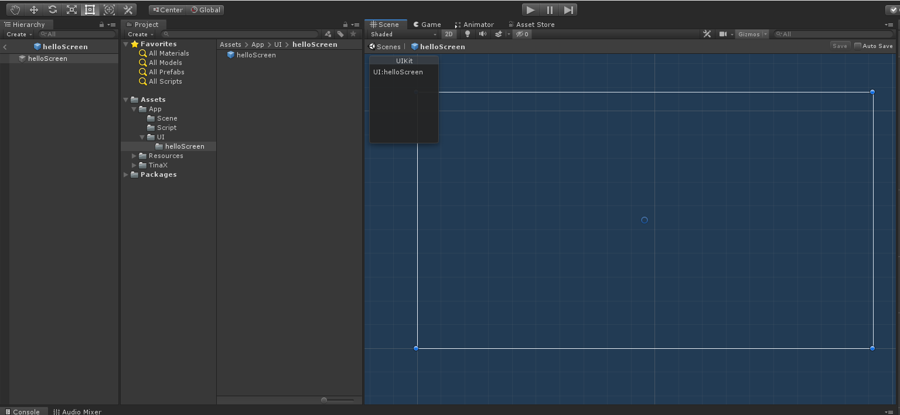

使用右键插入的传统方式，插入一个`xText`文本对象，用来显示“hello world”

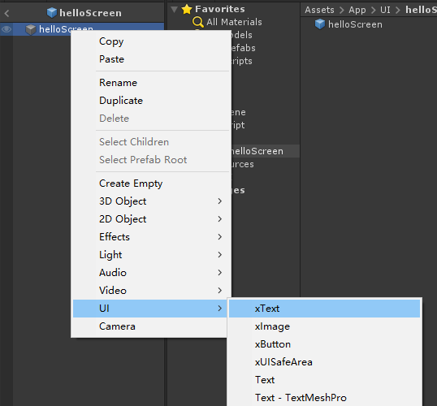

?> 注意：本文案例中使用“xText”而非uGUI原生提供的“Text”。 `xText`是 TinaX对uGUI原生Text类的封装，提供了一些功能扩展和优化。类似的对应关系还有 uGUI的`Image`和TinaX的`xImage`，`Button`和`xButton`等。 

我们拖拽文本控件到合适位置，并修改文本内容为“Hello World”， UI的制作暂且告一段落。

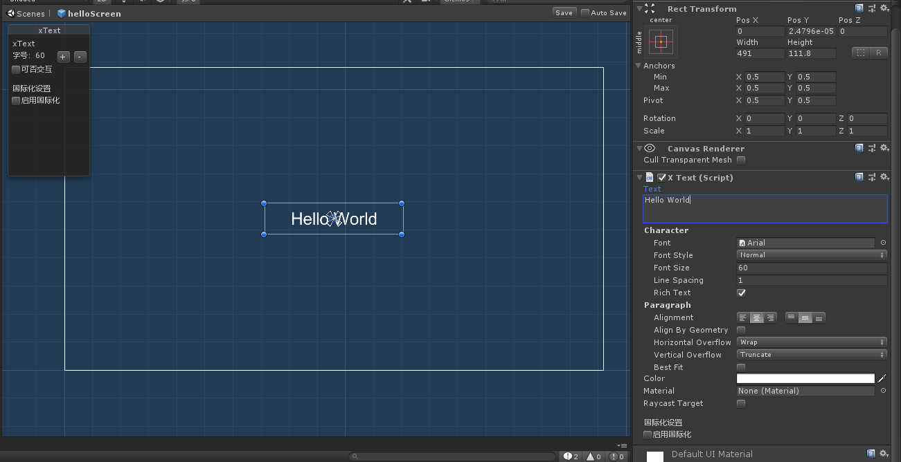

------

## UI组的使用

在早期的TinaX Framework中，我们使用UI的路径来加载UI, 如：

``` csharp
xxx.OpenUI("Assets/App/UI/helloScreen/helloScreen.prefab");
```

这样的写法乍一看没什么问题，但是在实际项目开发中，业务逻辑的程序们就开始抱怨了：这个路径太长了，很容易输错，即使从IDE且到编辑器找到UI文件后右键复制路径也很麻烦。

于是，从内部版本 TinaX 5.x开始，我们开始尝试加入了UI组的功能。

### UI组是什么？

UI组本质上就是一个`.asset`配置文件，将UI文件很长的路径名对应到一个较短的别名。

### 开始使用UI组

我们在目录“Assets/App/UI”下，右键“Create -> TinaX -> UI组”来新建一个UI组，并重命名为“MainUIGroup”.

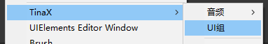

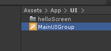

并在Inspector面板中，配置上述“helloScreen”这个UI的别名为“Hello”.

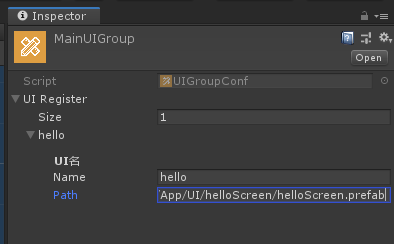


最后一步，我们要告诉TinaX 框架：“来，使用这个UI组来处理UI的工作。” 我们有两种方法可以实现，第一种是在代码中指定：

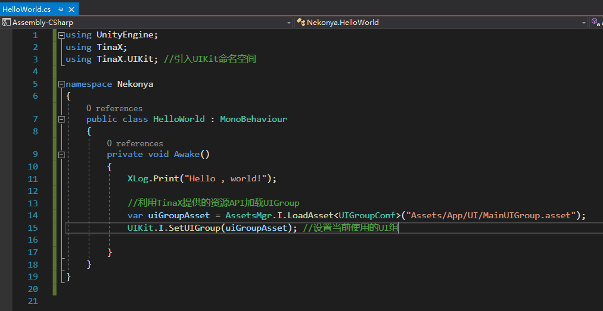

第二种方法是直接在配置文件中指定：

在Unity Editor 菜单中点击：”TinaX -> 配置 -> UI系统“，然后我们会在Inspector面板中看到相关配置项，

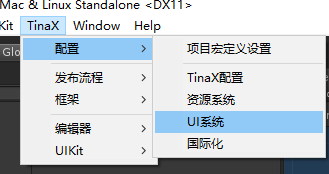

将我们之前新建的”MainUIGroup“文件拖入到配置项”Default_UI Group“中即可。配置工作完成。

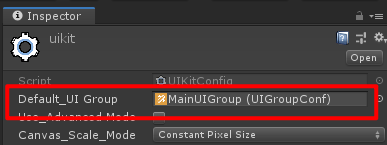

!> 当然，在配置文件中指定了默认UI组的话，之后也可以在代码中切换使用其他UI组。但通常建议全局只使用一个UI组

------

## 虚拟文件系统

”等等！我有问题！“

估计有不少人在看到上面的代码之后就有点懵了：什么？直接用编辑器下的路径加载UI?这个路径结构只在编辑器下有啊，打包发布之后这游戏不就崩了？

这就要说到TinaX的另一个功能了：虚拟文件系统（VFS: Virtual File System）.

VFS给开发者提供了一致的可寻址的文件统一加载策略，听起来有点复杂，简单的说，就是：通过TinaX虚拟文件系统，我们就可以直接使用"Assets/xxx/xxx"这样的路径来加载文件了，无论在编辑器下还是发布后的真机运行，都是完全一致的。（具体请参考VFS相关文档）。

要使用虚拟文件系统加载UI，首先我们得把UI添加到虚拟文件系统的资源管理策略白名单中，告诉它：“嘿VFS，来帮我管理下这些文件”。

### 添加UI目录到虚拟文件系统的白名单

我们打开Unity 新弄出来的统一的Project Setting窗口（编辑器菜单：“Edit -> Project Settings”）， 在窗口的“TinaX Framework -> 虚拟文件系统”项，可以看到关于白名单的设置。

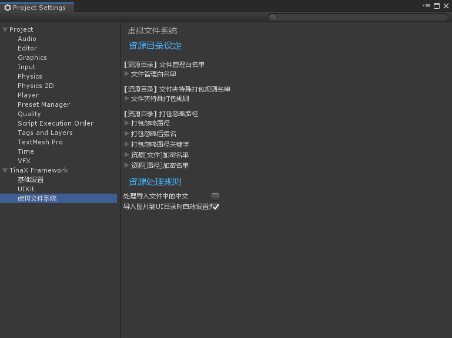

在本节“快速上手”文章中，我们不需要关系其他的设置项的内容，直接把UI文件的根目录`Assets/App/UI`添加进白名单即可。这样一来，这个目录下的所有内容就都可以被虚拟文件系统管理了。

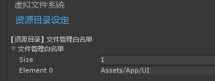


## 从入口代码中打开UI

还记得上一篇“快速入门”中使用的“HelloWorld.cs”这个文件吗，在上一篇的末尾我们说，这个文件在TinaX下已经相当于是游戏的全局入口初始化文件了，那么我们就在这个文件里打开UI吧。

首先我们需要`using TinaX.UIKit`这个命名空间，然后，我们只需要一句话就可以打开UI了。

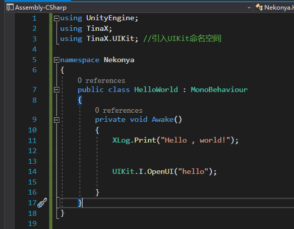 


试着运行一下，我们发现：

1. 场景“App.Startup”被自动启动
2. Game窗口中显示出我们刚刚制作的“Hello World” UI.


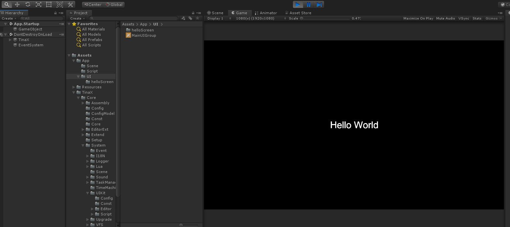

------

## 下一步

现在，我们已经可以在游戏窗口用UI的方式显示Hello World了，那么接下来，我们试试看，怎么让UI可以被点击：

### [3. 快速上手：与UI产生交集](/guide/quickstart/quickstart3)