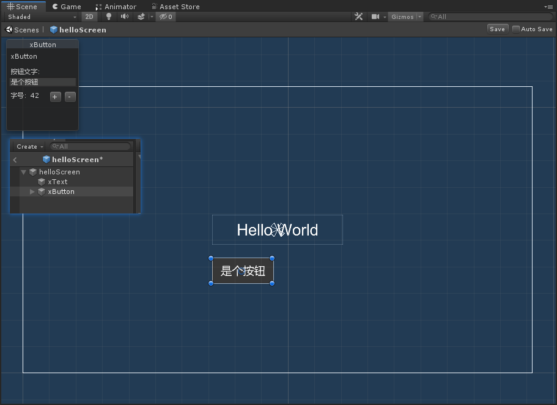
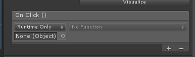
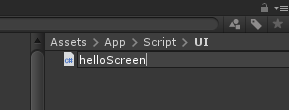
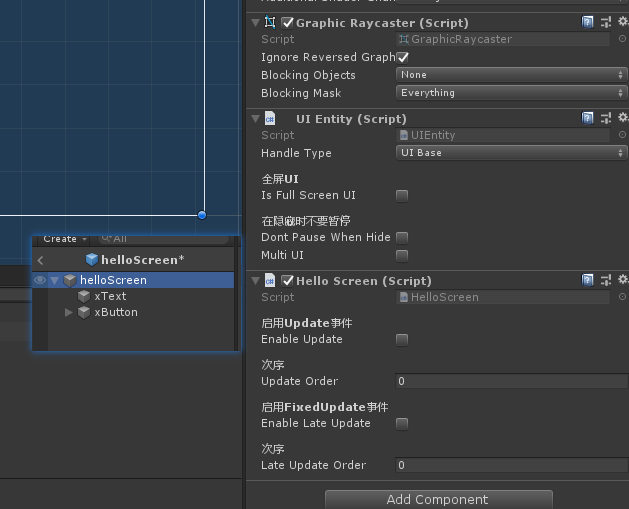
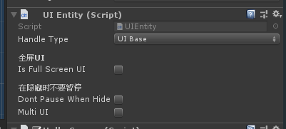
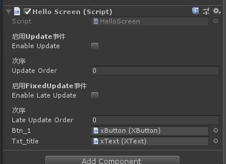
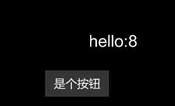
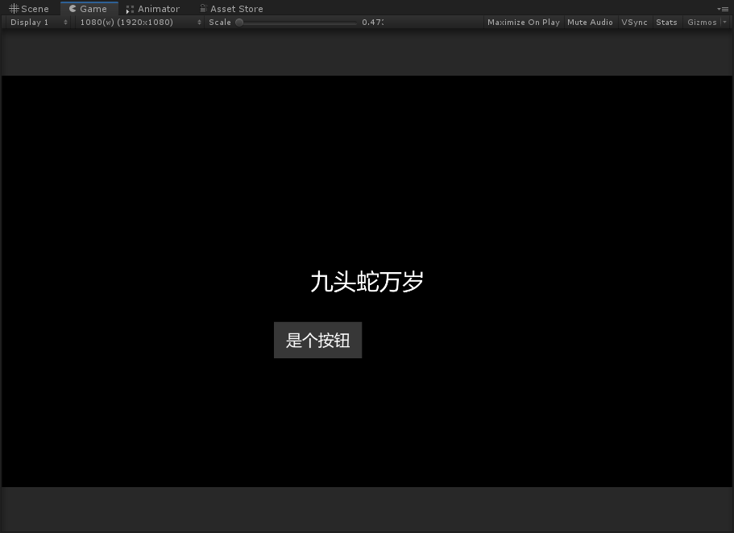

# 快速上手 ：与UI产生交集

> 马克吐温曾经说过：点了没反应的UI不是个好UI。

那么，在 [快速上手: UI Hello World](/guide/quickstart/quickstart2) 的例子中，我们往屏幕上显示了一个UI，那么接下来，我们看看怎么与UI产生交互吧。


## 做一个可以点击的按钮

首先，我们在上一篇制作的UI中新增一个`xButton`组件。



很多初接触Unity的开发者，在初级入门教程和Unity官方培训课的“蛊惑”下，会采用下图这种往按钮的OnClick里面拖代码的用法。



也不是说不好吧，只是不太适合。在TinaX中，我们试着规范了一套UI开发的实践方法。

------

## 主处理代码

在TinaX中，有这样一个约定: 在一个UI文件的跟节点上挂载一个代码组件，用作整个UI页面的主要逻辑处理。我们暂且称这个代码组件为“主处理代码”。

主处理代码可以为C#编写，也可以使用Lua语言、蓝图节点编写（需要安装相应的扩展，并在TinaX的设置中打开开关），当前案例采用C#编写。

首先，我们新建一个C#文件，命名为：“HelloScreen.cs”



代码如下：

```csharp
using TinaX;            //引用TinaX命名空间
using TinaX.UIKit;      //引入UIKit命名空间

namespace Nekonya
{
    public class HelloScreen : UIBase
    {
        
    }
}
```

> 注意：与我们直接在Unity里写UI逻辑不太一样的一点是：这里的`HelloScreen`继承自`UIBase`类而非`MonoBehaviour`

然后，我们把`HelloScreen`组件挂在在UI的跟节点“helloScreen”下，如下图所示。



注意，在我们的`HelloScreen`脚本上方，系统自动挂在了一个`UIEntity`组件，这是TinaX中每个UI文件都必须有的一个组件。从图上我们可以看出，UIEntity提供了一些选项，其中“Handle Type”默认选择为“UIBase”,也就是告诉系统，我们使用刚刚挂在的那个继承自`UIBase`的 `HelloScreen`脚本作为主要处理代码。




## 为按钮添加交互逻辑

我们在`HelloScreen`中编写如下代码：

```csharp
using TinaX;            //引用TinaX命名空间
using TinaX.UIKit;      //引入UIKit命名空间

namespace Nekonya
{
    public class HelloScreen : UIBase
    {
        public XButton btn_1;
        public XText txt_title;

        private int num = 0;

        protected override void XAwake()
        {
            btn_1?.onClick.AddListener(() =>
            {
                num++;
                if (txt_title != null)
                {
                    txt_title.text = "hello:" + num;
                }
            });
        }
        
    }
}

```


这段代码暴露出两个公开属性，我们在Inspector面板中，把按钮组件和之前的文本组件拖拽赋值给它。



试着运行一下，我们发现，我们做好了一个简单的计数器：



每当按钮被点击时，hello后面的数字就会+1.

!> 注意：由上述代码我们可以看出， UIBase中，我们使用重写父类`XAwake`的方法替代了`MonoBehaviour`中的`Awake`,同样的，我们对`Start`,`Update`等方法也做了类似调整。

------


## 跨越UI的数据

我们回顾一下刚才的代码：

首先我们有一个“HelloWorld”的类作为游戏的入口，并且我们在HelloWorld里打开了helloScreen这个UI。

然后我们定义了一个继承自`UIBase`的类`HelloScreen`来管理这个UI。


那么现在，我们试试看做这么一件事：在`HelloWorld`类中打开UI的同时，给UI传递一句话，然后，UI试着把这句话显示在屏幕上。


### UI参数

为了实现这样的需求，TinaX UIKit提供了一个叫UI参数的东西，使用起来很简单。

```csharp
UIKit.I.OpenUI("hello"); //原来的打开UI

UIKit.I.OpenUI("hello", "九头蛇万岁"); //修改一些
```


我们把原先的UI打开方法稍微修改一些，传入第二个参数。这第二个参数就会传递给被打开的UI.

那么这个UI参数传递给被打开的UI，到底传给谁了呢，答案就是传递给了这个UI的“主要处理代码”，也就是我们例子中的`HelloScreen`类。

现在，我们把上述的代码修改如下：

```csharp
using TinaX;            //引用TinaX命名空间
using TinaX.UIKit;      //引入UIKit命名空间

namespace Nekonya
{
    public class HelloScreen : UIBase
    {
        public XButton btn_1;
        public XText txt_title;

        private int num = 0;

        protected override void XAwake()
        {
            btn_1?.onClick.AddListener(() =>
            {
                num++;
                if (txt_title != null)
                {
                    txt_title.text = "hello:" + num;
                }
            });
        }

        public override void OnOpenUIMessage(object param)
        {
            if(txt_title != null)
            {
                txt_title.text = (string)param;
            }
        }

    }
}

```

可以看出，我们重写了`OnOpenUIMessage`方法来获取参数，并将其复制给文本组件。


运行游戏，效果如下：



## 下一步

接下来，我们看看如何使用lua语言加入到我们的游戏开发中

### [4. 快速上手： 使用Lua语言开发游戏](/guide/quickstart/quickstart_lua_1)