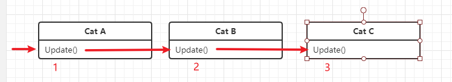

# TimeMachine

有时候，我们需要编写一些时间驱动的代码，如：在每帧检查键盘或者鼠标的输入、在固定的时间间隔运算和更新物理量等等。

通常在Unity中，我们使用继承自`MonoBehaviour`的类的Magic Methods来实现相关逻辑。如：`Update`, `FixedUpdate`, `OnGUI`等等。

``` csharp
using UnityEngine;

class Demo : MonoBehaviour
{
    void Update()
    {
        //xxxxxx
    }
}
```

<br>

TinaX TimeMachine提供了另一种方式，实现类似`MonoBehaviour`中的`Update`之类的方法的功能。以便于我们在某些场合更方便的编写时间驱动的代码。

TimaMachine入口静态类为: `TinaX.TimeMachine`

<br>

# 注册TimeMachine

我们可以使用如下的方法注册一个 `Update` 时间驱动方法:

``` csharp
using TinaX;

class Demo2 
{
    public Demo2()
    {
        TimeMachine.RegisterUpdate(OnUpdate);
        //注册之后，OnUpdate() 方法将被每帧调用
    }

    void OnUpdate()
    {
        //xxxxxxxxx
    }
}
```

<br>

方法原型（静态方法）:
``` csharp
ITimeTicket TimeMachine.RegisterUpdate(Action updateAction, int order = 0)
```

|参数 | 类型 |说明|
|-----|----|----|
|updateAction | `System.Action` | 每帧被调用的方法|
| order | `int` | 调用次序（详见下文）|

!> 在`MonoBehaviour`中注册的时间驱动事件，请务必记得在组件被销毁时（`OnDestroy()`方法里)取消注册.

<br>

## 时间驱动的方法类型

TimeMachine 提供如下三种时间驱动类型：

- `TimeMachine.RegisterUpdate`
- `TimeMachine.RegisterLateUpdate`
- `TimeMachine.RegisterFixedUpdate`

分别与Unity的`MonoBehaviour`中定义的`Update`,`LateUpdate`,`FixedUpdate`一一对应。


## 调用次序

在注册TimeMachine事件时，我们可以在传入`order`参数，该参数表示我们当前所注册的事件在TimeMachine中的全局的调用次序。

在原本的Unity MonoBehaviour中，我们是无法很直观的定义调用次序的（需要在Project Settings中设置，和代码是脱离的）。

比如我们三个组件`CatA`,`CatB`和`CatC`, 他们分别继承自`MonoBehaviour`并实现`Update`方法。

出于某种业务需求，我们希望在游戏的每一帧中，先调用`CatA`的`Update`，再调用`CatB`的`Update`,最后调用`CatC`的`Update`.



甚至我们可以再复杂一点：在上述的基础上，我们的三个组件分别实现`LateUpdate`方法，并且根据某种业务需求，我们需要在上述的基础之上，每帧调用完三个`Update()`之后，先调用`CatC`的`LateUpdate`.


甚至我们可以再复杂一点：在上述的基础上，我们的三个组件分别实现`LateUpdate`方法，并且根据某种业务需求，我们需要在上述的基础之上，每帧调用完三个`Update()`之后，先调用`CatC`的`LateUpdate`,然后调用`CatB`的`LateUpdate`, 最后调用`CatA`的`LateUpdate`.


到这一步位置，Unity给我们的`Update`和`LateUpdate`已经完全无解了。而通过TinaX TimeMachine，我们可以这么做：

``` csharp
using TinaX;
class CatA : MonoBehaviour
{
    void Start()
    {
        TimeMachine.RegisterUpdate(OnUpdate,0);
        TimeMachine.RegisterLateUpdate(OnLateUpdate,2);
    }

    void OnUpdate(){ /* xxxx */ }
    void OnLateUpdate(){ /* xxxx */ }
}

class CatB : MonoBehaviour
{
    void Start()
    {
        TimeMachine.RegisterUpdate(OnUpdate,1);
        TimeMachine.RegisterLateUpdate(OnLateUpdate,1);
    }

    void OnUpdate(){ /* xxxx */ }
    void OnLateUpdate(){ /* xxxx */ }
}

class CatC : MonoBehaviour
{
    void Start()
    {
        TimeMachine.RegisterUpdate(OnUpdate,2);
        TimeMachine.RegisterLateUpdate(OnLateUpdate,0);
    }

    void OnUpdate(){ /* xxxx */ }
    void OnLateUpdate(){ /* xxxx */ }
}
```
这样当我们带着次序（`order`）参数将方法注册给TimeMachine时，TimaMachine内部将始终保证每一帧中，次序(`order`)数值最小的方法将被最先调用，数值越大调用次序越靠后，数值相同则不能保证调用的前后次序。

如果不主动传递`order`参数,其默认为`0`.


<br>

# 取消注册TimeMachine

当我们不再需要之前注册的时间事件时，我们可以将其取消注册。方法之一是使用注册时传入的方法来取消注册：

``` csharp
using TinaX;
class Demo3 : MonoBehaviour
{
    void Start()
    {
        TimeMachine.RegisterUpdate(OnUpdate); //注册
    }

    void OnUpdate(){ /* xxxx */ }

    void OnDestroy()
    {
        TimeMachine.RemoveUpdate(OnUpdate); //取消注册
    }
}

```

方法原型（静态方法）：
``` csharp
void TimeMachine.RemoveUpdate(Action updateAction)
```
`LateUpdate`和`FixedUpdate`皆有对应的Remove方法, 不可混用.

<br>

## 使用 ITimeTicket 取消注册

`ITimeTicket`是注册时间事件时得到的返回值, 可用于取消注册。当我们使用匿名函数注册时间事件时，无法通过`TimeMachine.RemoveUpdate(Action updateAction)`的方式取消注册，这时便可以使用`ITimeTicket` 接口来取消注册。

``` csharp
using TinaX;
class DemoMeow : MonoBehaviour
{
    ITimeTicket m_UpdateTicket;
    void Start(){
        m_UpdateTicket = TimeMachine.RegisterUpdate(()=>{
            //xxxヾ(≧▽≦*)o
        });
    }

    void OnDestroy()
    {
        if(m_UpdateTicket != null)
            m_UpdateTicket.Unregister(); //或使用：m_UpdateTicket.Dispose();
    }
}
```
<br>

------

# 为什么使用TimeMachine

TinaX TimeMachine是一个乍一看有点多此一举的功能：“我直接写Update(){}就好了啊，为什么要"把简单的事情搞复杂"呢？”

TimeMachine对比Unity原生的Update等Magic Methods，具有如下区别或特点：

1. **脱离了MonoBehaviour:** 原生的`Update()`只能写在MonoBehaviour的子类中，而TimeMachine可以帮助开发者在不继承MonoBehaviour的代码(如一个Manager、一个Lua代码)中接受Unity的时间驱动事件.
2. **可控的调用次序：** 通过TimeMachine，我们可以在代码中自由控制在同一帧中，时间事件被调用的先后次序。（详见[#调用次序](#调用次序))
3. **可控的方法开始与取消：** 通过TimeMachine，我们可以自由控制"Update()"方法什么时候被时间驱动，什么时候停止，一方面节省优化了性能，另一方面可以有效的避免杂乱的`void Update() { if(xxxx){ xxx } }`这类写法.

<br>

# 技巧与推荐用法

## 在生命周期结束时要取消注册

在MonoBehaviour等可能被销毁的、有生命周期的类中，我们应该在其被销毁之前，取消注册所有之前注册的时间驱动事件，以避免出现不可预料的问题。

## 使用DisposableGroup来简化注册与取消注册的代码

比如，我们在MonoBehaviour中同时注册了多个时间驱动事件，那么在OnDestroy中我们也得写多个取消注册的方法。严重影响开发时的心情。

这时候，我们可以使用DisposableGroup来简化操作：

``` csharp
using TinaX;
class DemoMeow : MonoBehaviour
{
    private DisposableGroup m_DisposableGroup = new DisposableGroup();

    void Awake()
    {
        var update = TimeMachine.RegisterUpdate(() => { /*xxx*/});
        m_DisposableGroup.Register(update);

        var lateupdate = TimeMachine.RegisterLateUpdate(() => { /*xxx*/});
        m_DisposableGroup.Register(lateupdate);
    }

    void OnDestroy()
    {
        m_DisposableGroup.Dispose();
    }
}
```
上述代码在注册的时候多写了一行注册到DisposableGroup的代码，还是有点麻烦，还可以通过TimeMachine提供的扩展方法再次简化:
``` csharp
using TinaX;
class DemoMeow : MonoBehaviour
{
    private DisposableGroup m_DisposableGroup = new DisposableGroup();

    void Awake()
    {
        m_DisposableGroup.RegisterUpdate(() => { /*xxx*/ });
        m_DisposableGroup.RegisterLateUpdate(() => { /*xxx*/ });
    }

    void OnDestroy()
    {
        m_DisposableGroup.Dispose();
    }
}
```

关于DisposableGroup的详细说明请参考文档：[DisposableGroup](/cmn-hans/core/manual/DisposableGroup.md)

<br>
<br>

# XComponent

使用`TinaX.XComponent`包时，基类`XBehaviour`已内置了相关实现，我们可以在需要时调用`EnableUpdate()`来使`XBehaviour`的`Update()`方法生效，并在组件被销毁时（`OnDestroy`之前）自动取消注册。

`FixedUpdate`和`LateUpdate`同样有对应的`EnableFixedUpdate()`和`EnableLateUpdate()`方法.

``` csharp
public override void Awake()
{
    EnableUpdate();
}

public override void Update()
{
    //Todo...
}
```

<br>
<br>

------

# 高级：实现原理与细节

?> 以下内容是关于TimeMachine实现原理和细节的一些描述，如果您只需要知道如何使用TimeMachine，则不需要阅读以下内容。

### TimeMachine内部使用UniRx驱动。

TimaMachine内部使用UniRx来接收时间驱动事件，而不再创建出一个Component来接收Update，LateUpdate...

当TimeMachine没有收到任何注册时，TimeMachine是不运行的。当所有已注册的事件被取消注册时，TimeMachine内部也会停止运行。UniRx也像TimeMachine一样，可以把已经注册的Update给取消。

### 注册事件时，内部会根据次序进行排序操作。

TimeMachine在每次注册事件时，对所有已注册的次序进行排序。而在每帧的调用中不会有多余的操作。