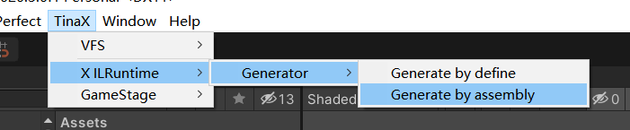
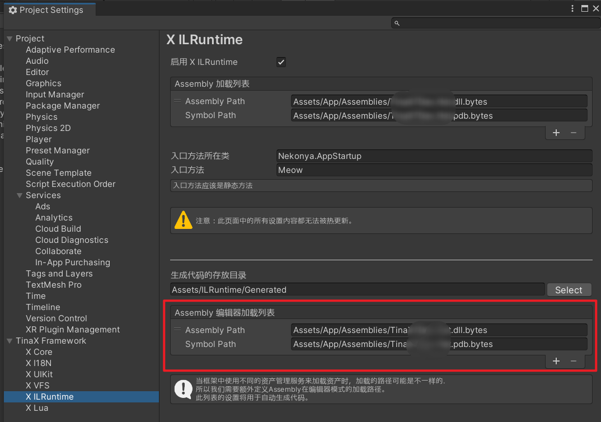

# 生成CLR绑定

使用ILRuntime时往往需要进行CLR绑定操作，关于CLR绑定的相关内容请先访问ILRuntime官方文档了解：[https://ourpalm.github.io/ILRuntime/public/v1/guide/bind.html](https://ourpalm.github.io/ILRuntime/public/v1/guide/bind.html)

## 生成器

TinaX对生成CLR绑定的操作进行了封装，使用TinaX进行项目开发时，我们无需按照ILRuntime官网文档的方式再写一遍生成CLR的代码。

在下图所示的菜单中，我们可以进行生成CLR绑定的操作。



其中提供了两种方式：

- Generate by define : 根据一些预定义的配置来生成CLR绑定代码. (如何配置请看下文)
- Generate by assembly : 实时分析热更工程中用到的内容来生成CLR绑定代码.

根据当前ILRuntime官方的最佳实践指导，我们推荐使用后者方式来生成CLR绑定代码.

<br>

## CLR生成配置

TinaX设计采用代码形式来对生成器规则进行一些配置。（如果有用过xLua的读者应该会很熟悉这种做法）

在项目的`Editor`目录中编写一个类，继承自接口`ICLRGenerateDefine`（命名空间:`TinaXEditor.XILRuntime`）

``` csharp
using TinaXEditor.XILRuntime;

public class CLRGenDefine : ICLRGenerateDefine
{
    //内容暂略   
}
```

接口中各个项目的说明如下：

- **List<Type> GetCLRBindingTypes()** : 当使用`Generate by define`方式生成CLR绑定代码时，此处返回的内容即是生成CLR绑定代码的指定内容。
- **HashSet<MethodBase> GetCLRBindingExcludeMethods()** : 当使用`Generate by define`方式生成CLR绑定代码时，此处返回的内容表示要排除的方法.
- **HashSet<FieldInfo> GetCLRBindingExcludeFields()** : 当使用`Generate by define`方式生成CLR绑定代码时，此处返回的内容表示要排除的Fields.
- **List<Type> GetValueTypeBinders()** : 返回内容表示指定生成的值类型绑定,在两种生成方式中皆可用。
- **List<Type> GetDelegateTypes()** : 返回内容表示指定生成的委托绑定,在两种生成方式中皆可用。
- **void GenerateByAssemblies_InitILRuntime(ILRuntime.Runtime.Enviorment.AppDomain appdomain)** : 当使用`Generate by assembly`方式生成CLR绑定代码时，我们需要在此处注册跨域继承适配器。详情参考ILRuntime官方文档。

该代码编写完成之后不需要主动注册，TinaX在生成CLR绑定代码时，会自动寻找工程中所有继承了`ICLRGenerateDefine`的类并整合配置。

<br>

## 自动注册

ILRuntime官方文档中描述，在生成CLR绑定代码之后，需要将这些代码在运行的时候注册到AppDomain中才能生效，也就是官方文档中`ILRuntime.Runtime.Generated.CLRBindings.Initialize(appdomain);`这句代码。

在TinaX中我们**不需要**进行这个注册操作，框架会在恰当的时机自行调用上述注册代码。

?> 因为在开发TinaX时，我们并不知道您有没有生成过CLR绑定代码，或者打算把代码生成到哪儿，所以TinaX是使用反射的方式完成自动注册的。请在IL2CPP出包时确保上述代码没有被裁剪掉。

<br>

## 编辑器下的热更工程加载路径

如果要使用`Generate by assembly`的方式生成CLR绑定代码，请确保在项目设置中的下图所示位置，配置编辑器下的热更新工程加载路径：



在使用`TinaX.VFS`作为资产管理框架时，运行时的资产加载路径是和编辑器下的加载路径一致的，所以这个设置看起来有点多余，但如果我们使用`Addressables`等第三方资产加载工具时，运行时的资产加载路径可能与编辑器并不一致，所以我们需要单独配置编辑器下的热更工程加载路径，在生成CLR绑定代码时，框架内部直接使用`System.IO`来加载热更工程。