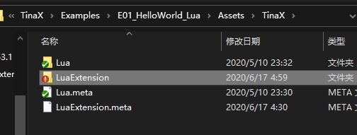
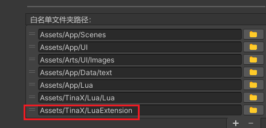

# TinaX Lua 扩展

TinaX Lua 扩展 是一个独立的代码仓库， 它使用lua语言对TinaX的各个Packages的功能进行了封装.

- 代码仓库：[https://github.com/yomunsam/TinaX.Lua.Extension](https://github.com/yomunsam/TinaX.Lua.Extension)
- Gitee镜像地址: [https://gitee.com/nekonyas/TinaX.Lua.Extension](https://gitee.com/nekonyas/TinaX.Lua.Extension)

------

## 这个扩展是干嘛用的

TinaX的各个Package是解耦合的，因此设计角度来说，`TinaX.Lua`不应该包含对具体各个功能的依赖，也就是说，我们不应该在`TinaX.Lua`中对其他Packages（如UIKit）的服务接口进行封装。

这样带来的问题就是，我们在Lua中调用Packages的功能时，使用的都是C#的方法，例如下方代码：

``` lua
local uikit = CS.TinaX.UIKit.UIKit.That;                --拿到UIKit的服务接口
local open_ui_param = CS.TinaX.UIKit.OpenUIParam();     --OpenUI的传入参数class实例化
open_ui_param_mask.UseMask = true;                      --设置参数
open_ui_param_mask.CloseByMask = true;

btn_1.onClick:AddListener(function()
    uikit:OpenUIWithParamAsync("msgBox", open_ui_param_mask, function(uiEntity,err) --直接调用 IUIKit
        -- .......
    end, "Hello,World", "Meow");
end)
```

这样的开发体验是非常不好的。而在旧版本的TinaX（6.4）中，由于并没有分Packages，所有功能都是堆在一起的，所以之前的版本我们可以在Lua中直接封装UIKit的代码，如[旧版文档中的案例](https://tinax.corala.space/legacy_doc/index.html#/api/system/uikit/uikit?id=lua-%e6%95%b4%e5%90%88%e5%90%8e%e7%9a%84%e6%89%93%e5%bc%80ui)如下：

``` lua
XCore.UIKit.OpenUI({
    ui_name = "msgBox",
    use_mask = true,
    smart_close = false,
    data = {    --传递给UI Handler的OpenUI参数
        title = "喵",
        content = "请按关机键继续下一步",
    }
})
```

类似的情况还有很多，当我们使用Lua封装了一层API之后，整个开发体验会好很多。

于是，**TinaX Lua Extension** 这个仓库就是用来干这事的了。

本扩展仓库并非以Packages的形式发布，而是一堆普通的Lua文件。开发者可以使用git 子模块将其导入到自己项目的Assets目录下，甚至可以直接下载文件来手动放置在项目里。也可以手动删除自己不需要的部分的代码。**总之，只是发布了一堆文件，自由折腾就是了。**

lua是典型的脚本语言，我们可以无视Packages的依赖关系，对任意功能进行封装。


<br>

-------

## 快速上手

那么，我们如何在项目中使用它呢。

### 简单的把文件弄进项目里

用任何你喜欢的方法，把本仓库的代码放进你的项目的Assets目录里即可。

简单的可以直接复制粘贴进去，如果想要更新方便也可以使用git子模块 等等。

比如我们的案例中，将代码放在了如下图所示的位置：`Assets/TinaX/LuaExtension`



<br>

### 确保我们的代码可以被加载

然后，我们要确保我们的文件可以正常的被TinaX框架加载。

比如说，我们使用`TinaX.VFS`管理资产加载的话，则需要把我们刚刚放进项目里的代码的路径添加到VFS的加载白名单中



?> "可以被TinaX框架加载"的本质是：框架在启动时，有某个功能模块向TinaX 的`XCore`登记：”我实现了框架内置的资产加载接口，框架的所有功能都可以通过我来加载资源了”。<br>
而`TinaX.VFS`在启动时就会向XCore进行上述的登记，所以Lua功能就可以使用VFS来加载资源了。<br> 同样的，只要实现了相关接口，我们也可以使用任意我们喜欢的方式来加载资源，比如`Resources`类，比如Addressables，比如我们自己项目里原有的资产管理框架 等。 <br>详细的说明请参考相关的 [文档](https://tinax.corala.space/#/cmn-hans/core/manual/IAssetService) 和 [示例工程](https://github.com/yomunsam/TinaX/tree/TinaX6.6/Examples/E03_ReplaceVFS)

<br>

### require所需的功能

简单是说，我们只需要在lua中`require`我们所需的文件就可以了。比如说，我们需要vfs相关的封装，只需要在lua中写:
``` lua
require("xxx.vfs.vfs") --对应仓库中"/vfs/vfs.lua.txt"文件
```

如果我们项目里需要很多功能，这时候挨个写起来就麻烦了，我们在仓库里提供了一个`init.lua.txt`文件，以方便我们快速的require.

``` lua
local extension_files_root_path = "Assets.TinaX.LuaExtension"; --lua扩展代码的根目录

local extensions = require(extension_files_root_path .. ".init");
extensions.Init(extension_files_root_path, {
    EnablePackages = {
        TinaXLuaExtensionDefine.VFS,
        TinaXLuaExtensionDefine.UIKit,
        -- ......
    }
});
```

Init方法需要接受两个参数：

- `s_extensionRootPath`, 字符串类型，指扩展代码根目录的加载路径。
- `t_params` , table类型，可传入一些initial相关的参数。目前可传入参数如下：
    - `EnablePackages`, 接收一个`string`类型的一维数组（有序table),其中包括我们需要启用的功能的名称。在上述示例代码中，我们使用`TinaXLuaExtensionDefine`这个全局table来传入名称（当作常量定义来使用），也可以直接传入写字符串。该参数如果为空(注意是`EnablePackages`为`nil`而不是为`{}`)时，默认为启用(`require`)所有代码.


上述的`Init`方法内部是同步加载的，如果我们需要异步的话，则需要写成回调方式，如下：

``` lua

local extension_files_root_path = "Assets.TinaX.LuaExtension"; --lua扩展代码的根目录
requireAsync(extension_files_root_path .. ".init", function(extensions, err)
    if err ~= nil then
        error("require \"init\" failed:" .. e.Message);
    end

    extensions.InitAsync(extension_files_root_path, {
        EnablePackages = {
            TinaXLuaExtensionDefine.VFS,
            TinaXLuaExtensionDefine.UIKit,
            -- ......
        }
    }, function(err)
        -- on init finish ....    
    end)
end)
```

`InitAsync`方法相较于`Init`方法，多接受了第三个参数:`f_onFinishCallback`, 

该参数是一个lua `function`, 它将在异步require完成后被调用。 当异步require过程中出现异常时，该回调方法将被立即触发，并且向回调方法传递一个异常参数。


### 使用具体的功能

在完成了上述操作之后，我们就可以使用相关封装后的功能了。

关于具体的lua api，您可在菜单中选择对象的项目查看。