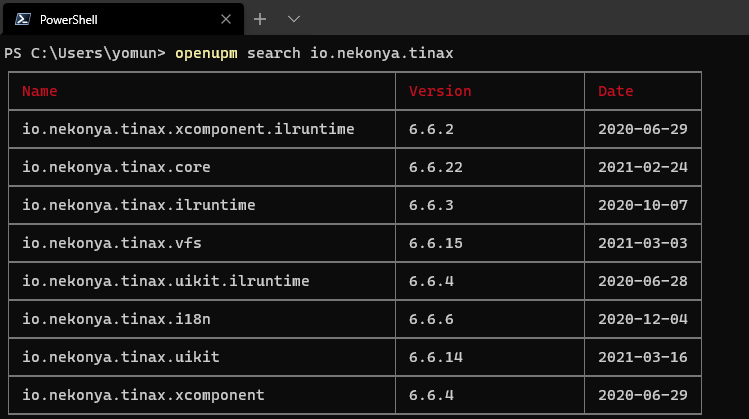

# 使用OpenUPM安装TinaX

OpenUPM是开源社区针对UPM（Unity Package Manager）包管理工具提供的第三方软件仓库及配套工具。

## 先决条件
使用OpenUPM方式安装TinaX，我们需要确保我们的开发环境有如下准备：
1. `npm`或`yarn`
2. [openupm-cli](https://github.com/openupm/openupm-cli/blob/master/README.zh-cn.md#openupm-cli)

?> 仅在使用openupm方式安装TinaX时需要上述准备。对于多人合作项目，不需要所有参与成员都安装npm和openupm-cli.

## 安装openupm命令行工具

在确保我们的开发环境中安装了`npm`（node.js的包管理工具）后，我们可以在命令行中通过如下命令安装openupm-cli工具。（如已安装请忽略）

``` bash
npm install -g openupm-cli
```

对于不使用`npm`的开发者，我们也可以通过`yarn`（另一个JavaScript的包管理工具）来安装openupm-cli.

``` bash
yarn global add openupm-cli
```

## 通过openupm安装TinaX

当安装命令行工具后，我们可在Unity工程的根目录下运行命令来向项目中添加包：

``` bash
openupm add 包名

# 例如安装TinaX.Core包
openupm add io.nekonya.tinax.core
```

我们可以使用`openupm search io.nekonya.tinax`命令来搜索所有TinaX相关的、存在于OpemUPM服务器中的包：




<br><br>

------

## 特殊地区使用指南

对于部分访问国际互联网有困难的中国大陆地区开发者，我们可以通过如下方式来优化我们的开发体验：

### npm淘宝镜像

如果使用`npm`有困难的话，我们可以使用npm的淘宝镜像，执行如下命令行安装:

``` bash
npm install -g cnpm -registry=https://registry.npm.taobao.org
```

之后我们可以在命令行中使用`cnpm`代替`npm`来安安装openupm-cli:

``` bash
cnpm install -g openupm-cli
```

### OpenUPM大陆镜像

OpenUPM提供了大陆地区镜像，在命令行中使用`openupm-cn`代替`openupm`即可使用大陆地区镜像。

如安装`TinaX.Core`包：

``` bash
openupm-cn add io.nekonya.tinax.core
```

搜索TinaX相关包：

``` bash
openupm-cn search io.nekonya.tinax
```

!> 注意：针对特殊地区的镜像对位于特殊地区的开发者有改善网络问题的正面积极作用。<br>但如果您的项目使用诸如"Unity Cloud Build"、"Github Actions"、"Azure DevOps"等服务器位于国际互联网的DevOps工具的话，针对特殊地区的镜像会对其有负面影响。<br>请结合自身项目的实际需求，斟酌决定使用何种方案。
