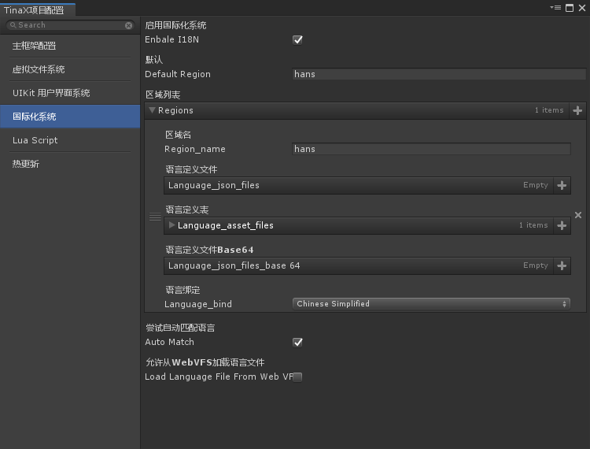
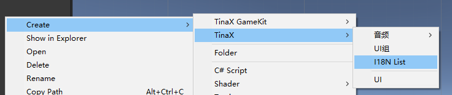
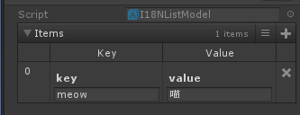
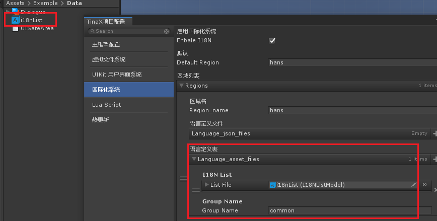
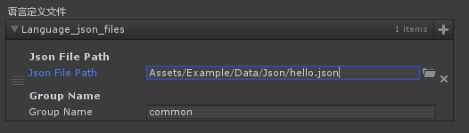
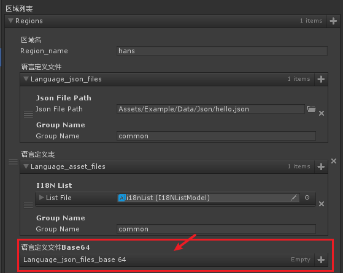
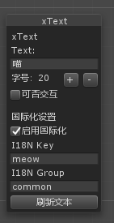
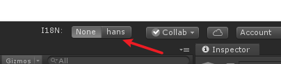

# 国际化

TinaX中， 国际化（I18N）系统提供了一个key/value对应查询的多区域适配机制。


## 概述

### Key / Value

在TinaX的I18N系统中，无论是资源还是要显示的文本，我们都采用了key/value对应查询的机制。

比如：

| key | zh-cn | en-us | jp |
|----|-----|-----|-----|
|`moew` | 喵 | meow |  にゃ |
|`helloworld`| 你好，世界 | hello,world | ハローワールド |

在使用多语言特性时，程序中只需要加载对应的key即可。

C#: 

```csharp
txt_hello.text = XI18N.I.GetString("meow");
```

Lua:
```lua
txt_hello.text = XCore.I18N.GetString("meow");
```


我们也可以配合[ VFS 虚拟文件系统 ](api/system/vfs/vfs) 的路径寻址特性，将I18N的Key/Value用于资源加载。


比如：

| key | zh-cn | en-us | jp |
|----|-----|-----|-----|
|`img_title` | "Assets/Img/cn/title.png" | "Assets/Img/en/title.png" |  "Assets/Img/jp/title.png" |

然后同样的加载：

```csharp
var img = VFS.I.LoadAsset<Sprite>(XI18N.I.GetString("img_title"));
```

```lua
local img , err = XCore.VFS.LoadAsset(XCore.I18N.GetSTring("img_title"));
```

> 之前有小伙伴问为啥我们不像别的I18N插件那样做prefab、图片之类的特殊资源的国际化。实际上我们大致评估后认为目前没必要，TinaX是有VFS这套“万物基于Path”的东西存在的。


### Group

组，是TinaX 6.5新加入的功能。在此之前，所有的Key都是全局的，这样如果工程比较大的话，开发者在处理key可能重复的问题上就有点不方便。

于是在TinaX 6.5之后，我们加入了组的概念，给`Key`进行分组。

使用分组之后的文本获取方式为：

```csharp
txt_hello.text = XI18N.I.GetString("meow","groupName");
```

Lua:
```lua
txt_hello.text = XCore.I18N.GetString("meow","groupName");
```

> 兼容性：如果不传入`GroupName`, 其默认为文本`common`

------


## 配置和使用

在设置面板的“国际化系统”选项中，



我们可以查看到I18N系统的相关设置，**注：该设置窗口仅在工程中启用了Odin插件时可见**，如果不使用Odin插件，请在Unity编辑器的Project Setting窗口中设置相关功能。

首先勾选“启用国际化系统”总开关来启用系统。

- 默认区域：启用I18N系统后，整个工程中默认使用的区域。
- 区域：TinaX I18N系统使用`区域`概念作为本地化适配的基本单位。
- 尝试自动适配语言： 当配置中某个区域绑定的语言与当前系统语言相符时，则优先使用该区域。（如果匹配失败，则使用默认区域）。
- 允许从WebVFS加载语言文件：如果启用该选项的话，I18N将可以从云端加载语言定义文件（优先加载本地，本地找不到文件时尝试从Web加载），注意：这时候切换区域和初始化操作将会是异步的。

每个区域的配置定义分为三个部分：

- 区域名： 当前定义的区域的名称(需全局唯一)
- 语言定义文件（Key/Value定义文件）
- 语言绑定： 将区域信息绑定给一个默认语言，以允许TinaX通过当前用户的系统语言自动适配区域。

> 当多个区域绑定了同一种语言之后，在自动匹配语言时，默认使用第一个。

### Key/value文件

TinaX中有两种方式定义一个Key/value文件，

#### `.asset`定义文件



我们可以在创建资源的菜单中选择“TinaX/I18N List”选项创建一个定义文件。



在其中，我们可以配置"key/value"的定义了。



并把它拖拽到区域配置的“语言定义表”项目中，同时为其设置“Group Name”。

### JSON定义文件

最开始TinaX是只支持Json文件的，`.asset`文件是在版本TinaX6.5中加入的。

在实际开发中，我们通常不会在编辑器中定义多语言文件，而是会使用Excel或者开发团队自己的工具，交由策划或者专门的翻译人员来编写这些文件。这时候`.asset`文件就显得很不方便了，于是TinaX一开始就支持了Json格式的定义文件，以便开发团队使用导表工具进行数据导入。

Json格式定义如下：

``` json
{
    "data":[
        {
            "key":"moew",
            "value":"喵"
        }
    ]
}
```

所有Key/value数据存放在名为”data“的数组下。

将json文件放入Unity工程，并为其添加资源管理系统的白名单之后，将路径填入区域配置中



文件即可被I18N系统加载。


> ps: 如果懒得自己写Excel导表工具的话，[这里有个凑合着能用的](https://github.com/yomunsam/Excel2Json) ，这个是作者以前没过脑子拿脚写出来的，反正凑合能用，但是代码质量就惨不忍睹了。

在区域配置中，还有个类似的选项是”语言定义文件Base64“， 这里和上面说的Json基本一致，也是Json文件，不过定义在这里的内容，在读取的时候会自动把Value值做Base64解码，以便满足一些特殊需求。



------

## API

### 监听区域切换事件

业务逻辑中，有时我们需要监听I18N区域切换的事件，有两个方式可以实现。

一、委托

```csharp
using UnityEditor;
using TinaX;

public class Demo : MonoBehaviour
{
	private void Start()
	{
		XI18N.I.OnRegionSwitched += OnI18NSwitch;
	}
	
	private void OnDestroy()
	{
		XI18N.I.OnRegionSwitched -= OnI18NSwitch;
	}
	
	private void OnI18NSwitch(string old_region_name, string new_region_name)
	{
		Debug.Log($"I18N区域从{old_region_name}切换到了{new_region_name}");
	}
} 
```

二、监听事件广播

C#写法

``` csharp
XEvent.Register("TinaX_OnI18NRegionChanged",(param)=>{
    string region = (string)param;
    Debug.Log($"I18N区域切换到了{region}");
});
    
//或者，事件名在框架里有个常量定义，
//这样就不用每次去找这个字符串到底是什么了，直接通过IDE的智能提示就能找到它。
XEvent.Register(EventDefine.X_OnI18NRegionChanged,(param)=>{
    string region = (string)param;
    Debug.Log($"I18N区域切换到了{region}");
});
```

Lua写法：

``` lua
XCore.Event.Register("TinaX_OnI18NRegionChanged",function(param)
    print("I18N区域切换到了" .. tostring(param))    
end)
```


### 切换区域

C#  原型

``` csharp
IXI18N UseRegion(string regionName); //返回接口自身，以便链式编程（虽然好像在这儿显得没啥用）
```

Lua 原型：

``` lua
XCore.I18N.UseRegion(regionName)
```


###　异步切换区域

使用异步方法时，可以从WebVFS加载资源

C#  原型

``` csharp
Task UseRegionAsync(string regionName); //返回接口自身，以便链式编程（虽然好像在这儿显得没啥用）
```

Lua 原型：

``` lua
XCore.I18N.UseRegionAsync(regionName, callback) --callback 接收一个异常参数，正常情况下为空
```


### 获取本地化字符

C#  原型

```csharp
string GetString(string key, string group = "common");
```

Lua 原型：

```lua
XCore.I18N.GetString(key, group) --group可留空，默认为“common”
```


## 其他用法

###　与UIKit   xText整合

在TinaX的UIKit中封装了原生的Text组件，`xText`

在使用xText时，我们可以直接在编辑器中为其指定I18N的`key`和`group`信息。



当我们配置了至少一个区域之后，在编辑器窗口的右上方，我们会看到多语言的切换工具栏



在运行状态下，点击切换会触发区域切换事件。在非运行状态下，上面xText中“刷新文本”的按钮，也会以工具栏的当前选项为准。

此外，xText中封装了"SetI18NKey"方法：

``` csharp
public XText txt_hello;

txt_hello.text = XI18N.I.GetString("hello","common");

//等效于
txt_hello.SetI18NKey("hello","common");
```

