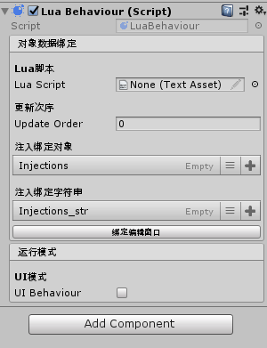

# LuaBehaviour

LuaBehaviour是一个Unity组件,用于把Lua脚本像`MonoBehaviour`代码一样挂载在`GameObject`上运行。



## GUI功能

#### Lua脚本 - Lua Script

用来绑定Lua脚本的设置项

#### 更新次序 - Update Order

`Update`和`LateUpdate` 方法被执行的顺序。

LuaBehaviour不使用Unity自带的`Update`和`LateUpdate`功能，而是由TinaX中的`TimeMachine`系统驱动帧事件的更新。更新次序最小为0，数字越小的更新次序，执行顺序越靠前。

> 注意，如果Lua脚本中没有申明`Update`或`LateUpdate`方法，则`TimeMachine`不会对该LuaBehaviour进行帧事件驱动。
>
> 因此，如果不需要Update的话，尽量不要申明方法，以节省资源

#### 注入绑定对象 - Injections

在CSharp编写的`MonoBehaviour`中，通过声明`public`的变量的方式与编辑器进行对象绑定。 这里提供的是类似的功能。

> 点击下面的“绑定编辑窗口”可以打开独立窗口来编辑绑定对象，这时候你可以直接把某个组件（如Image）拖进编辑窗口，系统会自动绑定`Image`类型，而非`GameObject` 
>
> (该功能需要`Odin Inspector`插件)

#### UI模式

用Lua语言处理UI逻辑，是游戏开发中很常见的操作。当使用LuaBehaviour处理UI的逻辑时，可以被调用一些特定的东西，具体见下方“Lua Api”的说明。

------

## Lua Magic Function

在LuaBehaviour中绑定的Lua脚本文件中，可以编写以下特定的方法，以及调用相应的API

#### Awake

类似`MonoBehaviour`中的`Awake`

#### Start

类似`MonoBehaviour`中的`Start`

#### OnDestory

类似`MonoBehaviour`中的`OnDestory`

#### Update

类似`MonoBehaviour`中的`Update`

#### LateUpdate

类似`MonoBehaviour`中的`LateUpdate`

##### OnUIOpenMessage

勾选 `UI模式`时，可通过此方法接收UI打开时传入的参数。该方法会在Awake之后，Start之前被调用

用例：

``` lua
function Awake()
    print("hello lua")
end

function OnUIOpenMessage(data)
    if data ~= nil then
        print("我收到了如下参数");
        dump(data)
    end
end

```

### Lua API

#### 获取自身`RectTransform` (针对UI模式的扩展)

在做UI的时候，要获取到自身的RectTransform有点麻烦，于是封装了，调用如下

``` lua
local rect_trans = self:GetRectTransform()

```

#### 关闭UI (针对UI模式的扩展)

``` lua
self:CloseMe()
```


#### 获取自身GameObject

``` lua
self.gameObject
```

#### 获取自身Transform

``` lua
self.transform
```

#### 安全的事件系统

在LuaBehaviour中，如果需要使用TinaX的[事件系统](system_event)的话，直接调用当然是可以的，但是这里提供了一个更安全的方法

``` lua
self:EventRegister(event_name, callback)
```

通过该方法注册的事件，会在LuaBehaviour被销毁时自动注销。

------

# 一些说明

!> 好像是Unity的编辑器Bug,在某些Unity版本中，打开**绑定编辑窗口**编辑的了内容之后，编辑器不会记脏，也就无法保存，这时候在编辑器的Inspector面板中随便改个数值再改回去，以便让编辑器正确的保存。 **注意是改回去，不是撤销！**