# 快速上手： 使用Lua语言开发游戏

?>  Lua语言是游戏开发中的常用脚本语言之一，现在，让我们一起试试如何在TinaX Framework中使用Lua语言开发游戏逻辑。

!> 注意：Lua语言的“快速上手”教程是在[之前的教程](/guide/quickstart/quickstart1) 的基础之上，本文不再重新介绍编Framework的一些功能的配置和用法，如有需要，请先阅读前篇。


## 导入Tencent xLua

TinaX 的 Lua功能基于 [Tencent/xLua](https://github.com/tencent/xlua) 开发，因此我们需要先下载并导入xLua内容。本文案例直接从xLua的Github页面下载最新版本。

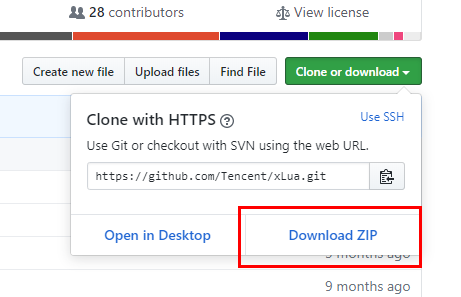

解压后，直接将xLua仓库的"Assets"目录下的`Plugins`和`XLua`两个文件夹（以及对应的.meta)文件复制到我们的项目中（理论上你可以放在任何位置

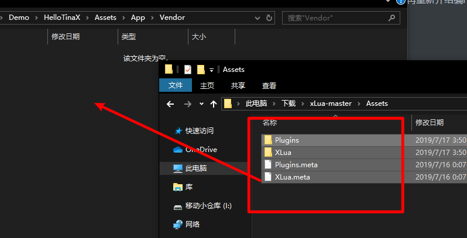

------


## 在TinaX中启用Lua功能

在导入xLua内容之后，我们发现TinaX还是不能使用Lua.

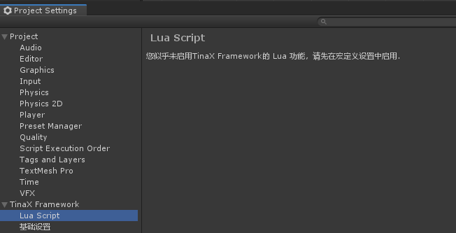

这是TinaX的特性之一，TinaX中的Lua功能需要通过宏定义开启。当Lua模块不启用时，框架中所有和Lua相关的功能的代码和资源都不会在发布的时候被打包，以免无意义的增加包体体积。


要启用Lua功能模块，首先，我们选择Unity Editor菜单`TinaX->配置->项目宏定义设置`

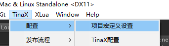

选择启用“LuaScript Runtime”，

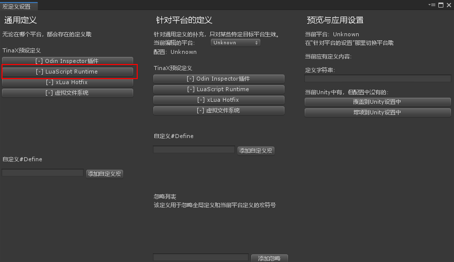

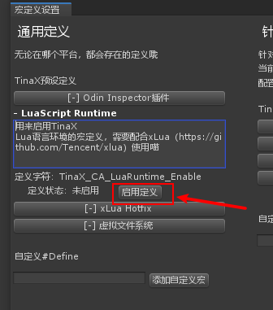


在窗口中间，我们将“当前编辑的平台”切换到“Standalone”

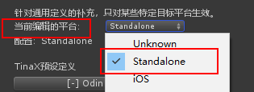

然后在窗口右侧我们选择“增项到Unity设置中”，

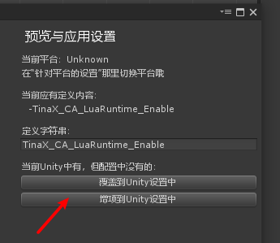

这时候我们在编辑器下就会响应当前的配置。如果你的游戏需要发布到其他平台，则需要依次对不同的平台进行设置。（当然你也可以直接在Unity自己的设置窗口里进行设置，是一样的。

!> 部分版本的Unity在进行上述修改操作之后，会存在部分bug，重启下Unity编辑器就好了。

在完成上述的操作之后，我们就可以开始正式使用Lua来开发Unity程序了。


## Lua Hello World

与C#开发不同的是，Visual Studio对Lua语言的支持并不友好（压根没支持），因此本文案例中，我们使用`Visual Stduio Code`编辑器来编写Lua代码。

首先我们在VSCode中“打开文件夹”到我们项目的根目录。

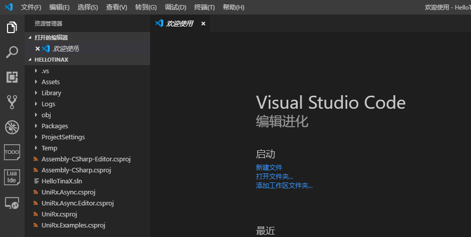

并在“Assets/App”目录下建立“Lua”目录，作为我们存放lua代码的地方。并新建文件`init.lua.txt`

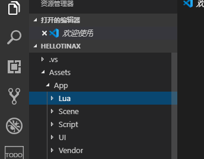

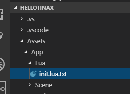

?> 为什么使用“.lua.txt”作为后缀名？ 因为Unity并不能识别标准的lua语言后缀名`.lua`，而使用`.txt`最为后缀名的话，Unity就可以把它识别为文本资源文件并进行一系列的操作。但是直接使用`.txt`作为后缀名的话，在代码编辑器中会很混乱，如vscode配合lua的debug插件时，会把工程中"readme.txt"之类的无关lua语言的文件也当成lua代码去识别并报错。因此我们在编辑器中把`.lua.txt`后缀识别为lua代码

（注：如果希望vscode把`.lua.txt`这种奇怪的后缀识别成lua代码的话，我们需要把下图的文件内容放在项目根目录的`.vscode`文件夹中，相关内容请查阅编辑器相关说明，本文不再赘述）

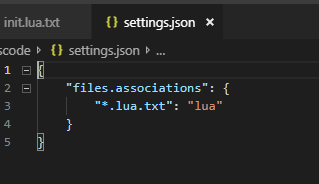

------

现在，我们在刚创建好的`init.lua.txt`文件中编写一些lua代码

``` lua
print("hello world , moew ~");
```


然后回到Unity编辑器，在Unity Editor的Project Setting窗口中，勾选下图所示的“启用lua环境”选项。

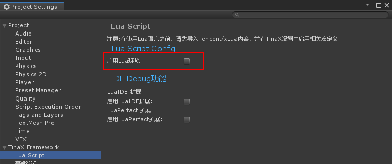

紧接着，将我们刚才编写的文件的路径填写进“框架启动后运行代码”的输入框中，并将“Lua文件后缀名”设置为`.lua.txt`

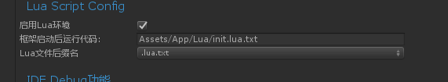

最后，不要忘了把我们lua文件所在的目录添加进“VFS 虚拟文件系统”的管理列表中

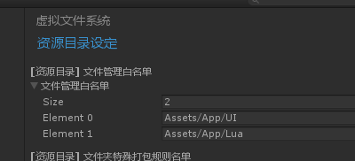

运行游戏，观察到控制台输出了我们代码中的“hello world, meow~”：

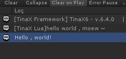


## 启动次序

在刚刚运行后的控制台输出中我们发现，在“hello world, meow~”输出之后，下面还有一句hello world，这个输出来自我们在第一篇“快速上手”中编写的`HelloWorld.cs`中的输出

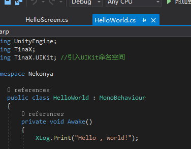

在当时我们介绍道：`HelloWorld.cs` 是在我们游戏启动后的第一个scene里作为全局入口的存在。而实际上，TinaX中的Lua语言代码会在所有scene被加载之前就开始启动。


## 下一步

但是说起来，如果是刚接触lua语言的Unity开发者，可能就有点懵：我们以前用C#开发游戏的时候，都是把代码放在GameObject上，在场景里启动它的。到了Lua这里就完全不一样了，这还能玩？

那么接下来我们就来看看，怎么把lua语言放在GameObject上。

### [5. 快速上手： 让Lua与GameObject发生关系](/guide/quickstart/quickstart_lua_2)