# 快速上手：让Lua与GameObject发生关系

?> 如果是刚接触lua语言的Unity开发者，可能就有点懵：我们以前用C#开发游戏的时候，都是把代码放在GameObject上，在场景里启动它的。到了Lua这里就完全不一样了，这还能玩？

那么接下来我们就来看看，怎么把lua语言放在GameObject上。然后把之前用C#写的内容，都改到Lua上。

## MonoBehaviour

熟悉C#开发的开发者，对MonoBehaviour这个东西一定都不陌生：我们想要让一个C#编写的类当作组件（Component）挂载在GameObject上的话，就一定得把我们的类直接或间接继承自MonoBehaviour类。

但是Lua语言中并没有MonoBehaviour类，甚至都没有类这个概念，这就很尴尬了。不过，TinaX给我们提供了一个类似的东西：`LuaBehaviour`

## LuaBehaviour

其实对于熟悉Lua在Unity中开发的开发者来说，LuaBehaviour并不是一个新鲜的概念，几乎各个使用lua的团队都会有自己的LuaBehaviour实现。而从名字我们就能很容易的看出来，`LuaBehaviour`是对`MonoBehaviour`的简单模仿。

下图是我们之前实现的`HelloWorld` C#类的最终代码，

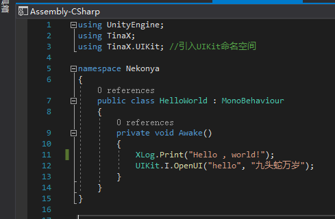

```csharp
using UnityEngine;
using TinaX;
using TinaX.UIKit; //引入UIKit命名空间

namespace Nekonya
{
    public class HelloWorld : MonoBehaviour
    {
        private void Awake()
        {
            XLog.Print("Hello , world!");
            UIKit.I.OpenUI("hello", "九头蛇万岁");
        }
    }
}
```


现在我们试着用lua语言来实现一个一样功能的东西

首先我们在工程中新建一个叫`hellolua.lua.txt`的文件

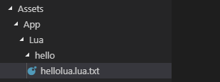

并编写代码如下：

``` lua
function Awake()
    print("Hello , world!");
    XCore.UIKit.OpenUI({
        ui_name = "hello",
        data = "九头蛇万岁 from lua"
    })
end
```

对比来看，我们发现基于TinaX实现的lua代码有几个特点：

1. lua中调用的方法和C#中不一样，比如openui
2. 我们实现了一个Awake方法，它有点像MonoBehaviour中的魔法方法`Awake`

?> TinaX 对所有内部功能的调用接口都进行了一层lua语言的封装，这样带来的好处是：1. 我们可以使用更贴近lua语言的风格来调用api; 2. 代码编辑器对lua代码自动补全等功能更友好。

我们写完代码之后，显然是没法把.txt文件挂载到GameObject上的，这时候luaBehaviour就来了。

我们在原来挂载`HelloWorld`组件的地方挂载一个新的组件`LuaBehaviour`，并删掉原先的`HelloWorld`.


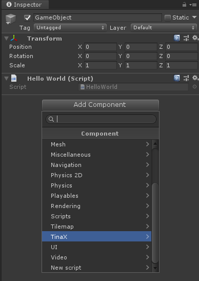


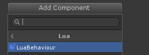

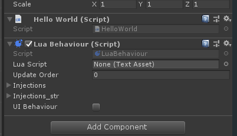

接着，我们将之前编写的`hellolua.lua.txt`文件拖拽到`LuaBehaviour`的`LuaScript`项，至此完成lua代码文件对GameObject的挂载工作。

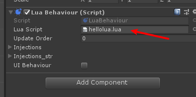

并尝试运行游戏。

我们发现，游戏运行起来与之前无异。

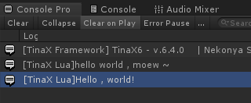


## 绑定其他对象

我们接着来把之前UI的代码`HelloScreen`替换到lua语言实现

``` csharp
using TinaX;            //引用TinaX命名空间
using TinaX.UIKit;      //引入UIKit命名空间

namespace Nekonya
{
    public class HelloScreen : UIBase
    {
        public XButton btn_1;
        public XText txt_title;

        private int num = 0;

        protected override void XAwake()
        {
            btn_1?.onClick.AddListener(() =>
            {
                num++;
                if (txt_title != null)
                {
                    txt_title.text = "hello:" + num;
                }
            });
        }

        public override void OnOpenUIMessage(object param)
        {
            if(txt_title != null)
            {
                txt_title.text = (string)param;
            }
        }

    }
}
```

但是这时候我们遇到了新的问题：我们在C#中公开了两个变量“btn_1”，"txt_title"，并且在Unity中通过拖拽的方式获取了它的值。那么我们在Lua中怎么完成类似的工作呢？

首先，我们在原来的UI中把HelloScreen组件删掉，替换成LuaBehaviour组件，并在`UIEntity`中把`Handle Type`设置为LuaBehaviour.

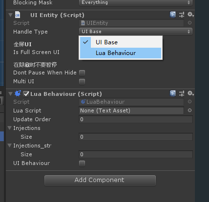

然后，我们在LuaBehaviour组件的`Injections`项目中新建两个元素，这是将“对象”与“名字”之间的绑定。我们将按钮和文本的`GameObject`拖拽绑定给两个名字“go_btn_1”和"go_txt_title". 

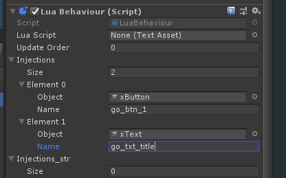

然后，我们就可以直接在代码里用这两个名字当作变量来调用了，TinaX会自动将两个GameObject绑定到对应名字的变量上，不需要我们关系。

最后，我们要勾选熵最下方的“UI Behaviour”选项，这样一来，luaBehaviour中挂载的lua代码就可以像`UIBase`一样接收传递给UI的参数了。

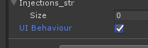

编写代码如下，并挂载给luabehaviour组件：

```lua
local btn_1 = nil
local txt_title = nil;

local num = 0

function Awake()
    btn_1 = go_btn_1:GetComponent("Button")
    txt_title = go_txt_title:GetComponent("Text")

    btn_1.onClick:AddListener(function()
        num = num + 1;
        txt_title.text = "hello" .. num
    end)

end

function OnUIOpenMessage(data)
    if data ~= nil then
        txt_title.text = tostring(data)
    end
end
```

运行游戏，发现效果一致：

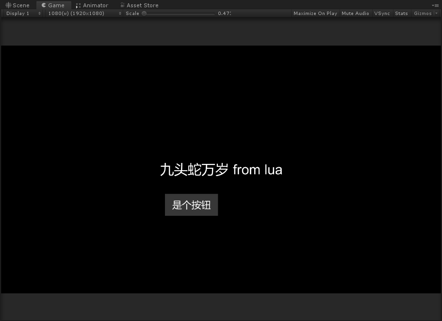

## 和odin一起工作

有没有觉得，这个部分，很啰嗦：

```lua
btn_1 = go_btn_1:GetComponent("Button")
txt_title = go_txt_title:GetComponent("Text")
```

LuaBehaviour的在编辑器中只能把GameObject拖拽绑定过来，没法直接拖拽Button、Text子类的组件，还得自己在代码里获取。

嗯，实际上，我们自己用的版本是可以这么干的。

TinaX中的绝大多数编辑器界面在开发时都是基于`Odin Inspector`插件标准的，（虽然我们对相关代码做了处理，使得在没有这个插件的时候也能正常使用，但是我们依然推荐将Odin与TinaX一起食用）

当我们直接导入并启用Odin插件之后，`LuaBehaviour`的效果如下：

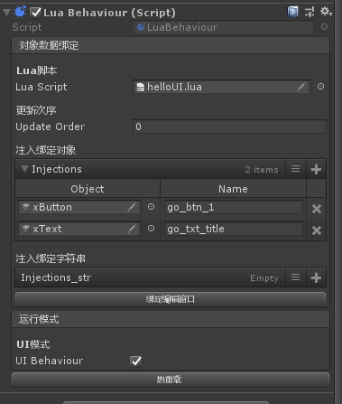

我们可以直接打开独立的编辑器窗口，以便我们往luabehaviour中拖拽不同的组件：

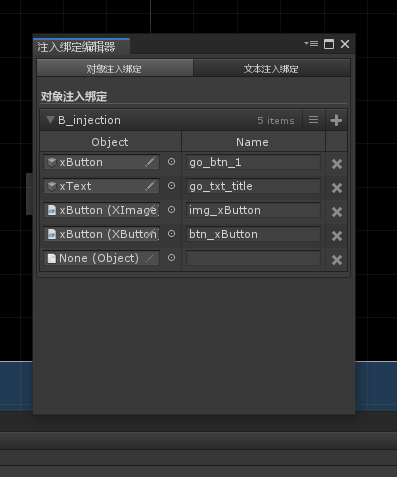

启用Odin插件之后，我们也可以在Unity Editor菜单“TinaX->配置”中找到独立的Framework配置面板，效果如下：

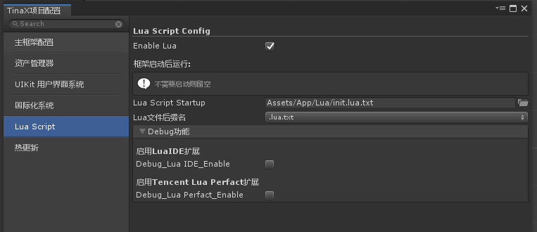

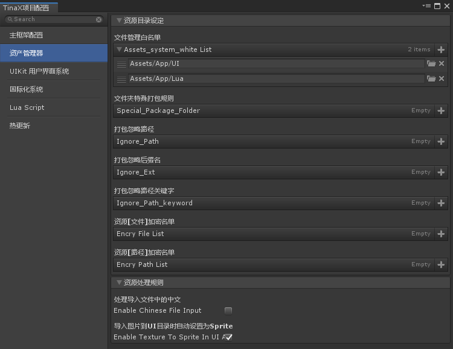

