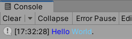
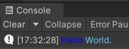
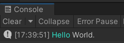
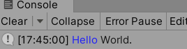

# 日志颜色助手

我们知道，向Unity编辑器的Console输出Log时，是可以指定颜色的：

``` csharp
using UnityEngine;

Debug.Log("<color=blue>Hello</color> <color=#66ccff>World</color>.");
```



通过给日志附加不同颜色，我们可以区分日志的类型、重要程度等。

但比较不方便的地方是，Unity有`Light`和`Dark`两套Editor Theme. 如果我们的项目有多人参与，且各自的Editor Theme不一致的话，会导致Log在不同参与者的编辑器中观感不一致。比如上述Log，在Editor Theme为Dark时，前半部分就很难看清晰，而在Light状态下，后半部分就很难看清晰。



<br>

## 使用日志颜色助手

TinaX 日志颜色助手 提出的解决方法是，约定一套常用的颜色，并在不同Editor Theme上自动切换。比如修改代码如下：

``` csharp
using TinaX.Core.Helper.LogColor;

Debug.Log($"<color=#{LogColorHelper.Color_Primary_16}>Hello</color> <color=#{LogColorHelper.Color_Normal_16}>World</color>.");
```

由于调用的属性内部会自动判断当前编辑器的Theme设置，因此在不同的Editor Theme中均可以比较清晰的看到日志效果：





<br>

如果我们一整条Log只需要同样的颜色的话，我们可以简写代码如下：

``` csharp
using TinaX.Core.Helper.LogColor;

Debug.Log(LogColorHelper.PrimaryLog("Hello World"));
```

<br>


## 内置配色方案

日志颜色助手共内置了如下颜色方案：

- `Primary`
- `Normal`
- `Success`
- `Danger`
- `Warning`

<br>

## 真机包上的日志颜色

我们上述的配色方案识别，是在编辑器中运行程序的情况。当脱离了编辑器之后，助手程序将默认输出适用于浅色背景的日志配色。

而在开发项目时，我们往往会在出真机包后，通过某些工具在真实设备上查看日志。而这时候，我们查看日志的工具UI可能也是深色的（比如某知名付费插件）。

这时候我们可以添加编译条件定义符号（亦俗称“宏定义符号”）`TINAX_RUNTIME_LOG_DARK`指定输出日志为适合深色背景查看的颜色方案。

如果使用诸如`LogColorHelper.PrimaryLog("xxx")`方法时，可使用编译条件定义符号`TINAX_RUNTIME_LOG_NOCOLOR`来输出不包含额外颜色信息的日志。