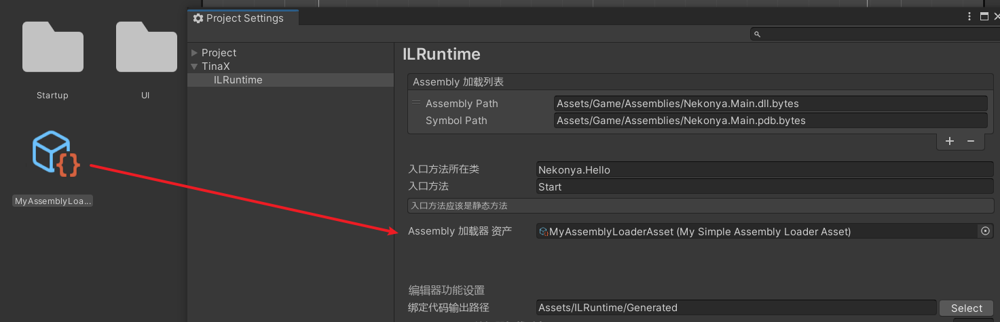

# Assembly加载器

默认情况下，TinaX.ILRuntime使用TinaX.Core内置接口`IAssetService`加载资产。

而对于中大型项目来说，往往会有自定义Assembly加载逻辑的需求，比如为了加密Assembly、为了从特殊位置加载等等。这时候我们就有两种方式来自定义Assembly的加载逻辑：

一种方式是自己实现TinaX.Core的内置接口`IAssetService`，这样相当于自己接管了整个TinaX框架各种模块的资产加载逻辑和热更新逻辑，比较重。

如果我们想简单一些，也可以实现一个自己的`Assembly加载器`，只接管TinaX.ILRuntime模块的Assembly加载逻辑。


## 创建自定义Assembly加载器

假设我们需要写一个简单的`Assembly加载器`，直接用`System.IO.File`类来加载Assembly，我们可以编写一个自己的Assembly加载器如下：

``` csharp
using System.IO;
using System.Threading;
using Cysharp.Threading.Tasks;
using TinaX;
using TinaX.XILRuntime.ConfigAssets;
using TinaX.XILRuntime.Loader;
using TinaX.XILRuntime.Structs;
using UnityEngine;

namespace Nekonya.AssemblyLoader
{
    [CreateAssetMenu(menuName = "Meow/MyAssemblyLoader", fileName = "MyAssemblyLoaderAsset")]
    public class MySimpleAssemblyLoaderAsset : AssemblyLoaderAsset
    {
        public override IAssemblyLoader CreateAssemblyLoader(IXCore core)
        {
            return new MySimpleAssemblyLoader();
        }
    }

    public class MySimpleAssemblyLoader : IAssemblyLoader
    {
        /// <summary>
        /// 是否支持异步加载
        /// </summary>
        public bool SupportAsynchronous => false; //不支持异步方法

        public AssemblyLoadResult LoadAssembly(AssemblyLoadInfo loadInfo, bool loadSymbol = true)
        {
            var loadResult = new AssemblyLoadResult(ref loadInfo);
            string assemblyLoadPath = Path.Combine(Directory.GetCurrentDirectory(), loadInfo.AssemblyPath);
            loadResult.AssemblyStream = new FileStream(assemblyLoadPath, FileMode.Open, FileAccess.Read);
            if (loadSymbol) //加载调试符号文件
            {
                string symbolLoadPath = Path.Combine(Directory.GetCurrentDirectory(), loadInfo.SymbolPath);
                loadResult.SymbolStream = new FileStream(symbolLoadPath, FileMode.Open, FileAccess.Read);
            }
            return loadResult;
        }

        public UniTask<AssemblyLoadResult> LoadAssemblyAsync(AssemblyLoadInfo loadInfo, bool loadSymbol = true, CancellationToken cancellationToken = default)
        {
            /*
             * 如果属性SupportAsynchronous表明加载器支持异步方法的话，将会调用本方法加载资产
             * 否则只会调用同步加载方法，
             * 因为本加载器SupportAsynchronous为false，所以不需要实现本异步方法
             */
            throw new System.NotImplementedException();
        }
    }
}
```

?> 代码文件（`*.cs`）的文件名应与继承自`AssemblyLoaderAsset`类的类名一致，如案例中类名为`MySimpleAssemblyLoaderAsset`, 代码文件名则必须为`MySimpleAssemblyLoaderAsset.cs`

!> 以上代码仅可在Editor环境下运行，不可用于生产环境，仅作演示。 


## 设置使用自定义Assembly加载器

根据上述代码，右键`Create > Meow > MyAssemblyLoader`在工程中创建资产, 打开`Project Settings`设置窗口，将创建的资产拖拽设置到如下图所示位置.



再次启动程序时，观察到框架已经使用我们自己编写的`MySimpleAssemblyLoader`类进行Assembly的加载。