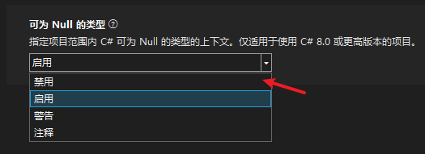

# 可空引用类型

当前，Unity的C#运行环境和Microsoft官方的C#运行环境（包括.NET、.NET Framework）都是有些许功能和版本差异的。而ILRuntime的热更工程通常是一个标准的.NET类库，这就导致热更工程和Unity工程之间也会有所差异。

本文初写与2021年12月初，而在不久前的2021年11月9日，.NET 发布了新的LTS版本 .NET 6.

如果您直接从 .NET 官网下载了SDK并新建了一个C#类库作为ILRuntime的热更工程的话，这个新版本的.NET类库会与Unity的C#环境见存在一些（并不致命）的兼容性问题，其中最明显的就是可空引用类型问题。

## 可空引用类型

C# 8 版本中引入了可用引用类型特性，并在C# 10 /.NET 6 版本中默认启用，它导致了我们写代码时候有些差异。

如在Unity中有如下方法：

``` csharp
public string Foo(string msg)
{
    if (msg == null)
        return null;
    return msg;
}
```

这个方法没有任何实际意义，只是举个例子，这段代码在Unity环境下是挑不出毛病的，但在 .NET 6 环境中，这种写法会得到一堆warning. 而按照.NET 6的写法，它得变成这样：

``` csharp
public string? Foo(string? msg)
{
    if (msg == null)
        return null;
    return msg;
}
```

以及如下代码：

``` csharp
string? a = GetStr();
if(!a.IsNullOrEmpty())
{
    DoSomething(a);
}
```
这段代码在 .NET 6 环境中也会一堆Warning，因为我们的这个`.IsNullOrEmpty()`扩展方法，我们知道它是在判空，但编译器不知道。`IsNullOrEmpty()`这个扩展方法在TinaX中实现是这样的：
``` csharp
public static bool IsNullOrEmpty(this string str)
    => string.IsNullOrEmpty(str);
```

而在.NET 6中，它应该需要是这样的：
``` csharp
public static bool IsNullOrEmpty([NotNullWhen(false)] this string? source)
    => string.IsNullOrEmpty(source);
```

<br>

了解了上述差异之后，现在我们面临的问题就是：如果您使用新的.NET类库版本作为ILRuntime热更工程，并且在热更工程中调用了原生层的框架API之后，你的热更工程里会有一堆warning.

Warning并不致命，但毕竟也不美观。而且是有公司团队会要求清空所有Warning，因此我们还是得提一下这个事。

## 解决方法和计划

首先，目前我们的所有接口还是按照旧版风格来写的。考虑对各Unity版本的兼容性，这样比较稳妥。于是相对的，如果热更工程使用新版.NET目标框架的话，为了避免编译器warning，需要手动配置禁用可空引用类型功能。可使用IDE进行设置禁用：



或在`.csproj`文件中配置：

``` xml
<PropertyGroup>
    <TargetFramework>net6.0</TargetFramework>
    <Nullable>disable</Nullable> <!-- 这里设置为disable -->
</PropertyGroup>
```

<br>

在后期版本中，如果Unity的各版本兼容性没问题的话，我们会逐步给框架接口加上`#nullable`宏来换成新版本写法。