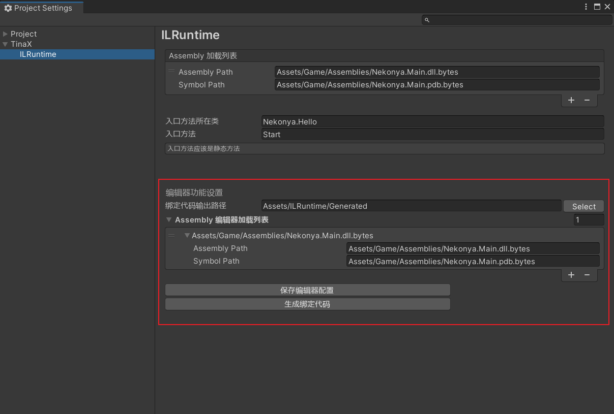

# CLR绑定

通常情况下，如果要从热更DLL中调用Unity主工程或者Unity的接口，是需要通过反射接口来调用的，包括市面上不少其他热更方案，也是通过这种方式来对CLR方接口进行调用的。

但是这种方式有着明显的弊端，最突出的一点就是通过反射来调用接口调用效率会比直接调用低很多，再加上反射传递函数参数时需要使用`object[]`数组，这样不可避免的每次调用都会产生不少GC Alloc。众所周知GC Alloc高意味着在Unity中执行会存在较大的性能问题。

ILRuntime通过CLR方法绑定机制，可以`选择性`的对经常使用的CLR接口进行直接调用，从而尽可能的消除反射调用开销以及额外的`GC Alloc`

?> 关于CLR绑定的原本用法和描述，请参考[ILRuntime官方文档-CLR绑定](https://ourpalm.github.io/ILRuntime/public/v1/guide/bind.html)

<br>

## 生成CLR绑定代码

TinaX.ILRuntime提供了生成CLR绑定代码的编辑器功能。首先确认相关设置：



设置页面中的“绑定代码输出路径”，用于指定生成代码的输出位置，该输出位置必须可以允许`unsafe`的C#代码。

“Assembly 编辑器加载列表”设置项配置一个将被加载的Assembly列表。

当点击“生成绑定代码”按钮时，框架的编辑器工具将加载上述配置列表中的Assembly文件，并根据加载的文件分析出需要生成的CLR绑定代码，输出到上述配置的输出路径位置。

生成代码功能，除了设置界面的按钮之外，也可以通过编辑器菜单`TinaX > ILRuntime > Generator > Generate clr binding code`触发。

?> TinaX 6.x 版本中，提供了两种生成代码的方式，一种是分析Assembly文件，另一种是类似`xLua`一样直接手动配置需要生成的内容。在TinaX 7.x版本中，我们取消了后者功能，因为与ILRuntime作者交流后，作者表示并不推荐使用后者方式。


<br>

## 自动注册

生成CLR绑定代码之后，在运行程序时需要将生成的代码注册到ILRuntime的AppDomain中才可生效。ILRuntime官方文档中调用的注册代码是:
``` csharp
ILRuntime.Runtime.Generated.CLRBindings.Initialize(appdomain);
```
而对于TinaX框架而言，这个注册过程是在框架启动过程中自动进行的，不需要开发者调用上述代码。

<br>

## CLR绑定生成配置

在生成CLR绑定代码之前，我们需要把项目中所有用到的跨域继承适配器注册给ILRuntime的AppDomain. 而这时候问题就来了，编辑器生成CLR代码的操作不会启动TinaX框架的XCore，也就是说编辑器工具无法获得开发者在Runtime下的配置。因此我们需要编写一个编辑器的配置代码以绑定项目中的跨域继承适配器。

在项目的`Editor`目录下创建代码类，继承自接口`ICLRBindingGenerateDefine` 如下：

``` csharp
using System;
using System.Collections.Generic;
using TinaXEditor.XILRuntime.Generator;

public class CLRBindDefine : ICLRBindingGenerateDefine
{
    public List<Type> ValueTypeBinders { get; private set; } = new List<Type>
    {

    };

    public List<Type> DelegateTypes { get; private set; } = new List<Type>
    {

    };

    public void Initialize(ref ILRuntime.Runtime.Enviorment.AppDomain appDomain)
    {
        //注册跨域继承适配器
    }
}
```

代码写好后，编辑器工具会自动找到这些配置类，不需要主动注册。当编辑器工具开始生成绑定代码时，会调用到`Initialize`方法，我们可以在此处注册跨域继承适配器。

该配置代码中还有`ValueTypeBinders` 和 `DelegateTypes`属性，我们可以在此配置需要生成的值类型绑定和委托类型。