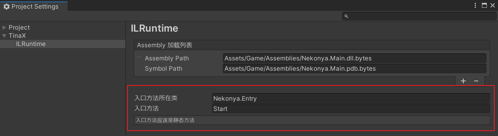

# 入口方法

TinaX.ILRuntime 模块功能会在框架启动完成时，自动调用预先约定的、位于热更工程中的方法。该方法我们称之为入口方法。

在Project Settings窗口中，我们可以设置入口方法。



如上图所示配置，对应的编写代码如下：

``` csharp
using UnityEngine;

namespace Nekonya;

public class Entry
{
    public static void Start() //框架启动完成后会执行此处方法
    {
        Debug.Log("Hello , World");        
    }
}
```

约定入口方法必须是**静态方法**，且方法名应该唯一，不可重载（Overload）多个同名方法。

<br>

## 返回值

原则上入口方法可以返回任意的返回值，框架不会识别返回值，但特例是对`async/await`语法做了处理。当发现入口方法的返回值如下时：
1. `Task` (`System.Threading.Tasks`)
2. `UniTask` (`Cysharp.Threading.Tasks`)

框架将在启动阶段等待入口方法执行。

提示
1.  `UniTask`官方提供了Nuget包可以使用，且通常情况下不需要将Nuget包里的DLL加载到热更工程中。
2. `.NET` 的 `ValueTask`(`System.Threading.Tasks`)类型在Unity的C#环境中不存在，如果入口方法的返回类型是`ValueTask`的话，框架将无法识别。
3. 框架仅会对无泛型的`Task`和`UniTask`进行等待

<br>

## 入口方法参数

我们可以给入口方法定义参数（parameter, 简中文化圈中亦称之为“形参”），如：

``` csharp
namespace Nekonya;

public class Entry
{
    public static void Start(IAssetService asset, IXCore core)
    {
        //xxx
    }
}
```

当框架调用入口方法时，会尝试对其进行[依赖注入](/zh-Hans/core/manual/dependency_injection)。如果定义的参数无法被依赖注入的话，将会报错。