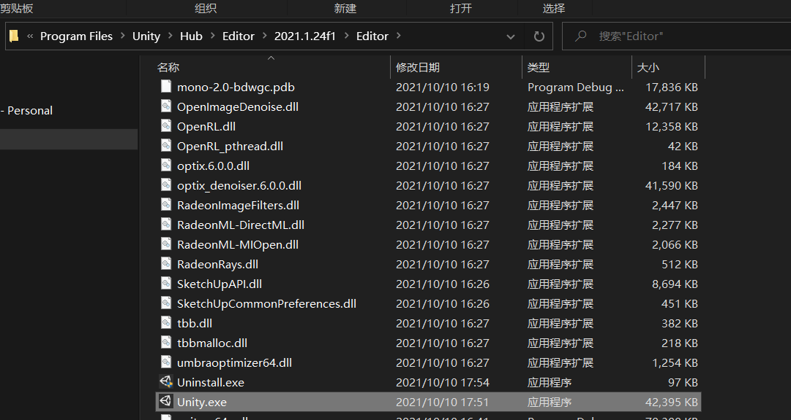
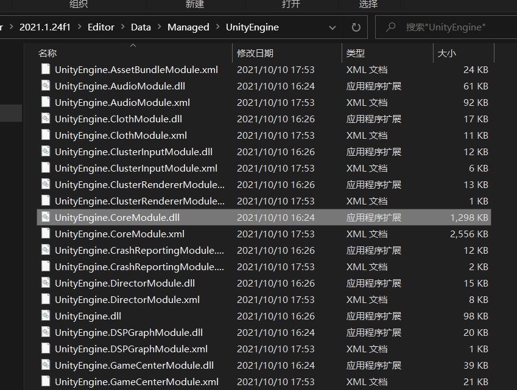
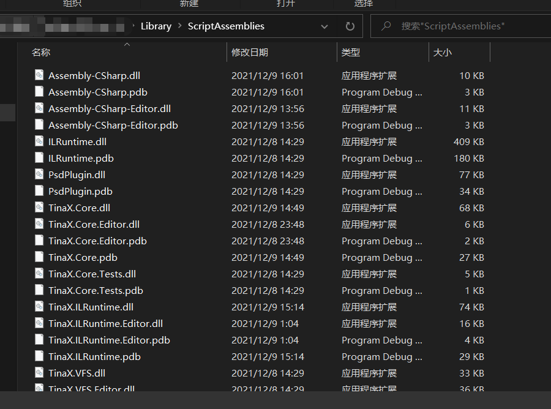

# 热更新工程

在一个常见的游戏热更新架构中，我们将代码分为两个部分：`原生层`和`热更层`。（详见：[基础通识：代码热更新](/zh-Hans/common/manual/code-hot-update)）.

对应到ILRuntime项目中，我们的框架、我们写在`Assets/`目录下的代码都属于原生层。

通常我们会新建一个或多个.NET类库，在其中编写代码并编译出dll后，交给原生层中的ILRuntime将它们运行起来。这些dll被称之为热更层。

此外需要注意的是，ILRuntime解释执行dll文件，因此通常情况下，我们希望Unity不要把热更层的dll文件当作dll文件来理解并尝试加载，而是单纯的当成一个普通的二进制文件放着就行。因此在项目中，这些热更层的dll文件通常会改成`xxx.dll.bytes`的命名。

 

ILRuntime的官方案例中采用`.NET Framework`作为.NET库的目标框架，而在实践中我们发现，使用 新`.NET（.NET 5+）`、`.NET Core`、`.NET Standard`目标框架的.NET库皆可被ILRuntime执行。且并不限定为C#类库，使用.NET平台的其他语言类库（如F#）都是可以被执行的。

 

热更工程中的语言写法与通常的.NET项目类似，但由于运行时不再是CLR而是ILRuntime，因此会有些许兼容性和性能优化方面的差异。（其实即使是Unity和.NET Core之间也是有种种差异的）其中一些明显的差异会在ILRuntime官方文档和TinaX.ILRuntime文档中被介绍，而一些细节差异，以及对新特性支持方面的差异，请关注社群信息（包括Github Issues、社区文章等）或在了解ILRuntime的原理后自行尝试探索。

## 引用关系 :id=reference

在Unity项目中，如果我们要输出日志的话，通常使用`Debug.Log("xxx")`方法. 该方法位于命名空间`UnityEngine`，它是Unity引擎内部提供的，显然我们的热更工程作为一个普通的.NET类库工程，是不可能有这个方法的。
于是我们就需要从外部找到这些方法所在的dll文件，并添加进热更工程的引用配置中。

这些dll文件大概分为几种：
1. Unity自身功能的DLL
2. 我们写在工程`Assets/`目录里的代码生成的DLL
3. Packages自身的DLL
4. Packages引用的DLL

我们分别看看到哪儿可以去找到它们：

### Unity自身功能的DLL

首先我们可以通过Unity Hub等方法，找到Unity引擎本体的安装目录

然后在上图所示目录的`Data/Managed/UnityEngine`子目录位置，见到这些DLL文件

常用的文件比如`UnityEngine.CoreModule.dll` ，`Debug.Log(xxx)`的功能就在这个dll文件中。还有比如`UnityEngine.UIModule.dll`，uGUI的相关API就在这个dll文件中。

### ScriptAssemblies

当我们使用编辑器打开过一次工程后，在相对工程根目录`Library/ScriptAssemblies`的位置会出现许多dll文件。

其中，如果我们直接在项目`Assets/`目录下新建一个代码文件，这个代码最后会被编译到`Assembly-CSharp.dll`这个文件中。如果我们在项目里的`Editor`目录下新建一个代码文件，它最终会被编译到`Assembly-CSharp-Editor.dll`这个文件中。（但是热更工程不应该引用Editor代码，所以不用管它）

项目中通过"Unity Package Manager"安装的Packages，其生成的dll也会存放在这个目录中。

在项目`Assets/`目录下通过`Assembly Definition`文件（`*.asmdef`）定义的Assembly也会编译成同名dll文件存放在该目录下

 

### Packages引用的DLL

有时候Packages自身也会直接引用一些dll文件并存放在packages目录下。比如`TinaX.Core`包就以dll形式引用了