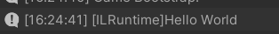
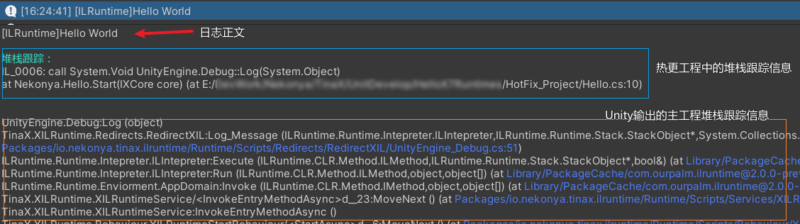
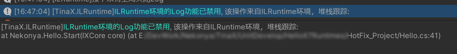

# ILRuntime中的日志

在ILRuntime的热更新工程中，我们依然可以使用`UnityEngine.Debug`类输出日志，如：

``` csharp
using UnityEngine;

Debug.Log("Hello World");
```

且为了方便调试，框架对从热更工程中输出的日志进行了一些处理。

<br>

## 日志前缀

TinaX默认给所有从热更工程中输出的日志增加了一个前缀`[ILRuntime]`.



目的是方便检索和识别来自热更工程的输出，尤其在配合一些日志插件（如`Editor Console Pro`）是会让日志很直观。

### 设置前缀 <!-- {docsify-ignore} -->

我们可以在代码中（在主工程和热更工程中皆可）设置日志前缀.

``` csharp
using TinaX.XILRuntime;

LogOptions.EnablePrefix = true;            //启用或禁用日志前缀
LogOptions.PrefixText = "[热更工程]";      //修改日志前缀文本
```

<br>

## 堆栈跟踪

TinaX默认会给所有从热更工程中输出的日志打印其在热更工程中的堆栈跟踪信息。（Unity自身是不认识热更工程里的代码的）



### 设置堆栈跟踪

打印堆栈跟踪信息有助于调试，但自然也会消耗更多资源，我们可以在代码中设置是否启用堆栈跟踪：
``` csharp
using TinaX.XILRuntime;

LogOptions.StackTraceLog = false;   //不打印"Log"级别（即 Debug.Log）日志的堆栈跟踪信息
LogOptions.StackTraceError = true;  //打印"Error"级别（即 Debug.Error）日志的堆栈跟踪信息
```

<br>

## 日志开关

在代码中，我们也可以关掉日志功能。（当然，直接用Unity的总开关也行）

``` csharp
using TinaX.XILRuntime;

LogOptions.Enable = true;           //日志总开关
LogOptions.EnableLog = false;       //禁用"Log"级别（即 Debug.Log）日志
LogOptions.EnableWarning = true;    //启用"Warning"级别（即 Debug.Warning）日志
LogOptions.EnableError = true;      //启用"Error"级别（即 Debug.Error）日志
```

### LogOptions的Log

为了方便调试追踪，如果在代码中设置了`LogOptions`类中诸如日志开关之类的敏感设置，会在Console中产生对应的Log并输出该操作的堆栈跟踪信息。



