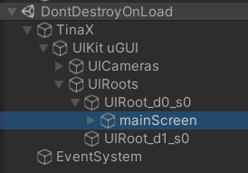
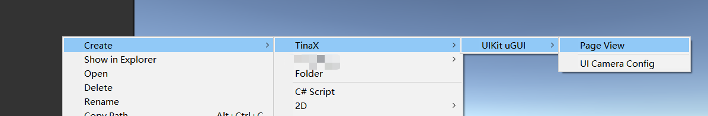

# 开始使用 TinaX.UIKit.UGUI

?> 在开始之前，请阅读[TinaX.UIKit基本概念](/zh-Hans/uikit/manual/basic)。

`TinaX.UIKit.UGUI`为`TinaX.UIKit`提供了基于uGUI的实际业务实现。

## 添加模块

安装了`TinaX.UIKit.UGUI`包之后，我们需要按如下方式将其注册到UIKit中。

``` csharp
var core = XCore.CreateDefault()
    .AddUIKit(builder => //设置UIKit功能
    {
        builder.AddUGUI(); //给UIKit添加uGUI支持（需要安装TinaX.UIKit.UGUI包）
    });
await core.RunAsync();
```

?> 通常，TinaX框架所有模块往XCore添加功能时的"AddXXX()"方法都位于`TinaX.Services`命名空间中。

此外，`TinaX.UIKit.UGUI`模块依赖TinaX框架的**内置资产服务接口**以加载uGUI Prefab. 关于内置资产服务接口的更多信息请参考文档[TinaX的资产管理](/zh-Hans/common/manual/asset-management)

## 服务接口

`TinaX.UIKit.UGUI`模块对外提供的服务接口是`TinaX.UIKit.IUGUIKit`, 我们可以从服务容器中获取该接口：

``` csharp
using TinaX;
using TinaX.UIKit;

var uGuiKit = core.Service.Get<IUGUIKit>();
```

<br>

## 打开UI

如[UIKit基本概念](/zh-Hans/uikit/manual/basic#open-ui-page)中所描述的，打开UI页实际上包括了获取UI页和推入UI Group两个步骤。

``` csharp
var page = await uGuiKit.GetUIPageAsync("page uri"); //获取UI Page （page uri将在下文讨论）
uGuiKit.PushScreenUI(page); //把UI页推到uGUI屏幕空间的简化方法
```
与直接使用UIKit包的`IUIKit`方法相比，`IUGUIKit`中可以使用`PushScreenUI`方法简化获取Group的步骤。因为`TinaX.UIKit.UGUI`模块会默认对uGUI生成屏幕空间UI相关内容。



<br>

## Page控制器

Page控制器是我们编写的UI逻辑代码，我们新建一个class并继承自`TinaX.UIKit.UGUI.UGUIPageController`. 

``` csharp
using TinaX;
using TinaX.UIKit;
using TinaX.UIKit.UGUI;
using UnityEngine;
using UnityEngine.UI;

public class HelloScreen : PageControllerBase
{
    [Binding]
    public Text Txt_Title;

    void Awake()
    {
        Txt_Title.text = "Hello, World";
    }
}
```

`UGUIPageController`是一个继承自UIKit `PageControllerBase`的抽象类，不继承MonoBehaviour，上文的`void Awake()`实现也与MonoBehaviour无关。

该类中`[Binding]public Text Txt_Title;`会自动将View中的元素注入绑定给Controller，因此我们可以在`Awake`中直接使用它。

之后在获取Page时传入控制器参数, 以使它与Page相关联。

``` csharp
var page = await uGuiKit.GetUIPageAsync("page uri", new HelloScreen());
```

<br>

## Page View

我们知道，uGUI是基于GameObject来显示UI元素的，因此`TinaX.UIKit.UGUI`定义的Page View（页视图）也是与之对应的。

在编辑器下，每一页UI使用一个prefab资产编辑，在UIKit的`GetUIPageAsync`阶段，Page会加载对应Prefab，在Page被推入UI Group时，Prefab会被实例化为GameObject以显示。

在编辑器Project窗口空白处右键，选择菜单`Create > TinaX > UIKit uGUI > Page View`可以创建一页UI Page View的Prefab.


